# Walmart Recruiting - Store Sales Forecasting

**Kaggle:** https://www.kaggle.com/c/walmart-recruiting-store-sales-forecasting

**MLflow (DagsHub):** https://dagshub.com/rkvit23/ML-FINAL.mlflow

**WandB project:** https://wandb.ai/rkvit23-free-university-of-tbilisi-/walmart-final

---

## სარჩევი

1. [ამოცანის ანალიზი](#1-ამოცანის-ანალიზი)
2. [რეპოზიტორიის სტრუქტურა და გაშვება](#2-რეპოზიტორიის-სტრუქტურა-და-გაშვება)
3. [Time-Series ამოცანის სპეციფიკა — მთავარი დიზაინის გადაწყვეტილებები](#3-time-series-ამოცანის-სპეციფიკა--მთავარი-დიზაინის-გადაწყვეტილებები)
4. [EDA](#4-eda--რა-დავინახეთ-მონაცემებში)
5. [Cleaning / Preprocessing](#5-cleaning--preprocessing)
6. [ვალიდაციის სტრატეგია](#6-ვალიდაციის-სტრატეგია)
7. [Feature Engineering](#7-feature-engineering-ხის-მოდელები)
8. [Feature Selection](#8-feature-selection)
9. [ჰიპერპარამეტრების ტუნინგის მეთოდოლოგია](#9-ჰიპერპარამეტრების-ტუნინგის-მეთოდოლოგია)
10. [არქიტექტურები და ექსპერიმენტები](#10-არქიტექტურები-და-ექსპერიმენტები)
11. [Post-processing: საშობაო შიფტი](#11-post-processing-საშობაო-კვირის-შიფტი)
12. [საბოლოო შედარება](#12-საბოლოო-შედარება-და-გამარჯვებული)
13. [MLflow ტრექინგი, Pipeline-ები, Model Registry](#13-mlflow-ტრექინგი-და-სტრუქტურა)
14. [WandB](#14-wb-ნეირონული-ქსელები)
15. [გუნდური მუშაობა](#15-გუნდური-მუშაობა)

---

## 1. ამოცანის ანალიზი

მოცემულია Walmart-ის 45 მაღაზიის ისტორიული კვირეული გაყიდვები დეპარტამენტების ჭრილში
(2010-02-05-დან 2012-10-26-მდე, 143 კვირა) და უნდა ვიწინასწარმეტყველოთ ყოველი (Store, Dept, Date)
სამეულის გაყიდვები ტესტის კალენდარზე (2012-11-02-დან 2013-07-26-მდე), ანუ 39 კვირით წინ.
ტრეინში 421,570 სტრიქონია, ტესტში - 115,064. სულ 3,331 (Store, Dept) სერიაა
ტრეინში, საიდანაც 11 წყვილი ტესტში საერთოდ ახალია და fallback-ს საჭიროებს. 1,285
სტრიქონზე გაყიდვები უარყოფითია. მთელი ისტორია სულ 2.75
წელია.

### 1.1 მეტრიკის ანალიზი - WMAE

$$WMAE = \frac{1}{\sum w_i}\sum_{i=1}^{n} w_i\,|y_i - \hat{y}_i|, \qquad
w_i = \begin{cases}5, & \text{holiday კვირა}\\ 1, & \text{სხვა}\end{cases}$$

ამ ფორმულის სამი თვისება მთელი პროექტის დიზაინს განსაზღვრავს. პირველი — ეს
აბსოლუტური და არა კვადრატული შეცდომაა: MAE-ს ოპტიმალური წერტილოვანი პროგნოზი
პირობითი მედიანაა და არა საშუალო, გაყიდვები კი ძლიერად right-skewed არის, ამიტომ
MSE-ზე ტრენინგი სისტემატიურად ზემოთ გადაგვახრიდა. სწორედ ამიტომ ვცდილობთ ყველგან,
სადაც შესაძლებელია, პირდაპირ L1/MAE ობიექტივზე ვატრენინგოთ (LightGBM-ს
objective="l1" აქვს, XGBoost-ს - reg:absoluteerror, DL-ში ყველგან L1 loss-ია)
და არა MSE-ზე ტრენინგი "იმედით", რომ MAE-ც კარგი გამოვა. მეორე — holiday
კვირა 5-ჯერ მეტს იწონის, თუმცა ტესტში holiday კვირების წილი მხოლოდ ~7.8%-ია — მაგრამ
მეტრიკაში მათი ეფექტური წილი უკვე ~30%-ია. ამიტომ ტრენინგისას ყველგან
sample_weight = 5-ს ვაძლევთ holiday სტრიქონებს, რომ ტრენინგის loss ზუსტად
შეჯიბრის მეტრიკა გახდეს — და ამის სისწორეს ბრმად არ ვენდობით, ცალკე აბლაციითაც
ვამოწმებთ. მესამე — მეტრიკა აბსოლუტურ დოლარებშია
და არა პროცენტში, ანუ დიდი მაღაზიები/დეპარტამენტები დომინირებენ მასში: $200k-იანი
სერიის 5%-იანი შეცდომა 100-ჯერ მეტს იწონის, ვიდრე $2k-იანი სერიის იგივე 5%-იანი
შეცდომა. DL-ში ეს ნიშნავს, რომ per-series სკალირება გვჭირდება ტრენინგის
სტაბილურობისთვის, მაგრამ თვითონ ეს სკალირება ამახინჯებს რეალურ დოლარებში
გამოსახულ მეტრიკას — ამიტომ ცალკე კონფიგით ვამოწმებთ scale-weighted ვარიანტსაც
(loss წონდება უკან დოლარებში). და ბოლოს — ტესტში ხვდება Thanksgiving 2012 და
Christmas 2012, წლის ორი ყველაზე ექსტრემალური კვირა, ორივე 5x წონით. ვინც შობის
კვირა კარგად იწინასწარმეტყველა, მან ფაქტობრივად მოიგო მთელი შეჯიბრი.

### 1.2 რას მოითხოვს დავალება და როგორ ვფარავთ

ყველა არქიტექტურის საუკეთესო მოდელი პაიპლაინადაა შენახული, რომელიც პირდაპირ დაუმუშავებელ
test.csv-ზე ეშვება, საერთო ჯამში საუკეთესო კი Model Registry-ში დარეგისტრირდა `WalmartBestModel`-ის სახელით
და model_inference.ipynb სწორედ იქიდან ტვირთავს მოდელს და აწყობს submission.csv-ს.
ნეირონული ქსელები (N-BEATS, DLinear, PatchTST) ორივეგან - MLflow-შიც და WandB-შიც
ილოგება.

---

## 2. რეპოზიტორიის სტრუქტურა და გაშვება

```
ML FINAL/
├── preprocessing.py                  # საერთო preprocessing მოდული (ორივე წევრი ამას ვიყენებთ):
│                                     #   ჩატვირთვა, cleaning, კალენდარი, WalmartFeatureBuilder,
│                                     #   DL სერიების მატრიცა, store-share დესეგრეგაცია
├── evaluation.py                     # საერთო შეფასება: WMAE, დროითი holdout, expanding CV
│                                     #   fold-ები, submission-ის აწყობა
├── models.py                         # საერთო DL კლასები (NBEATS/DLinear/PatchTST) + ორივე
│                                     #   pyfunc pipeline (TorchForecastPipeline,
│                                     #   StoreShareForecastPipeline)
├── model_experiment_SARIMA.ipynb     # კლასიკური: ARIMA/SARIMA
├── model_experiment_Prophet.ipynb    # კლასიკური: Prophet
├── model_experiment_LightGBM.ipynb   # ხის მოდელი + საერთო EDA + full FE + Optuna
├── model_experiment_XGBoost.ipynb    # ხის მოდელი (იგივე FE, სხვა ბუსტინგი)
├── model_experiment_NBEATS.ipynb     # DL: N-BEATS
├── model_experiment_DLinear.ipynb    # DL: DLinear/NLinear
├── model_experiment_PatchTST.ipynb   # DL: PatchTST
├── model_experiment_TimesFM.ipynb    # ბონუსი: Google TimesFM zero-shot + xreg
├── model_inference.ipynb             # საუკეთესო მოდელი Registry-დან → submission.csv
├── pictures/                         # ნოუთბუქების მიერ დაგენერირებული გრაფიკები + სქრინშოტები
├── requirements.txt
└── README.md
```

მთელი preprocessing და შეფასების ლოგიკა ორ მოდულშია გატანილი — `preprocessing.py`
და `evaluation.py` — და საერთო DL-კლასები `models.py`-შია. ორივე გუნდის წევრი
ერთსა და იმავე კოდს ვიყენებთ, ამიტომ ყველა არქიტექტურა
გარანტირებულად იდენტურ ფიჩერებზე/მეტრიკაზე დგას. ეს მოდულები ყოველი დალოგილი
მოდელის artifact-შიც ინახება (`code_paths` ყველა `log_model`-ში) — ამიტომ
Registry-დან ჩამოტვირთული პაიპლაინი ნებისმიერ გარემოში იტვირთება, ამ ფაილების
ხელით მიწოდების გარეშე.

ხის მოდელები და კლასიკური ნოუთბუქები CPU-ზეც სწრაფად ეშვება,
N-BEATS/DLinear/PatchTST/TimesFM-ს Colab/Kaggle-ის T4 GPU ურჩევნია.
`preprocessing.CANDIDATE_DIRS`-შია ჩამოთვლილი სად ეძებს დატას, ხოლო Kaggle-ზე
გაშვებისას ნოუთბუქები თავად ამოწმებენ `/kaggle/input`-ის არსებობას და საჭირო
შემთხვევაში თავად ჩამოწერენ `preprocessing.py`/`evaluation.py`/`models.py`-ს
GitHub-იდან — ანუ ერთი და იგივე ნოუთბუქი ლოკალურადაც და Kaggle-ზეც ხელით
რედაქტირების გარეშე მუშაობს.

გაშვება მარტივია: ნოუთბუქის MLflow უჯრაში `DAGSHUB_USER`/`DAGSHUB_REPO`, DL
ნოუთბუქებში დამატებით `WANDB_PROJECT`/`WANDB_ENTITY`, შემდეგ ექსპერიმენტების
ნოუთბუქები ნებისმიერი თანმიმდევრობით შეიძლება გაეშვას. ბოლოს, საუკეთესო
არქიტექტურის Final სექციაში `REGISTER_AS_BEST=True` ვდებთ და მას ვუშვებთ თავიდან,
რომ Registry-ში დარეგისტრირდეს, შემდეგ `model_inference.ipynb` წერს
`submission.csv`-ს. დროის ბიუჯეტისთვის `N_TRIALS`/`TIMEOUT` (Optuna),
`RUN_FULL_SARIMA`, `RUN_SWEEP` (WandB sweep) და DL კონფიგების `epochs`. რეალურად
LightGBM-ისა და XGBoost-ის სრულმა 30 trial-იანმა Optuna ძებნამ თითოეულმა
დაახლოებით 50-56 წუთი წაიღო (`TIMEOUT=None`-ით, უსასრულოდ ლოდინით ბოლომდე).
SARIMA-ს store-level სრული (m=52) ვარიანტი 9 წუთს მოითხოვს. დანარჩენი მოდელები
რამდენიმე წუთშივე ეშვება.

---

## 3. Time-Series ამოცანის სპეციფიკა — მთავარი დიზაინის გადაწყვეტილებები

სანამ კონკრეტულ მოდელებზე გადავალთ, სამი ფუნდამენტური
არჩევანი გვქონდა გასაკეთებელი, რომელიც ყველა მოდელზე ვრცელდება.

### 3.1 პროგნოზის სტრატეგია: Recursive vs Direct vs Multi-output

39 კვირით წინ პროგნოზირების სამი კლასიკური გზა არსებობს. რეკურსიული მოდელი ერთ
ნაბიჯს წინ პროგნოზირებს და საკუთარ პროგნოზს უკან იძახებს input-ად, 39-ჯერ ზედიზედ.
ერთი მოდელი ეყოფა და მოკლე ლაგებიც (lag-1..4) გამოსადეგია, მაგრამ loss
გროვდება ნაბიჯიდან ნაბიჯზე და ტრენინგსა და ინფერენსს შორის distribution mismatch
ჩნდება (ტრენინგში ნამდვილი ლაგები, ინფერენსში კი უკვე პროგნოზირებული). Direct
სტრატეგიაში ფიჩერები მხოლოდ ისეთია, რაც h ნაბიჯით ადრეც ცნობილია — შეცდომა აღარ
გროვდება, მაგრამ მოკლე ლაგებს ვკარგავთ. Multi-output (MIMO) კი მთელ 39-კვირიან
ვექტორს ერთბაშად აბრუნებს, რაც ჰორიზონტებს შორის კოჰერენტულობასაც იძლევა, თუმცა
მოდელს ამისთვის სპეციალური არქიტექტურა სჭირდება.

ჩვენ სამივე ოჯახზე განსხვავებული არჩევანი გავაკეთეთ, კონკრეტული მიზეზით. ხის
მოდელებში Direct ავირჩიეთ, რადგან, საბედნიეროდ 2.75-წლიანი ისტორია ნიშნავს, რომ
lag-52 და lag-104 ტესტის ყველა თარიღისთვის ტრეინშივეა (ბოლო ტესტ-კვირისთვისაც კი
lag-52 = 2012-07-27, რაც ტრეინის ბოლოზე ადრეა) - ანუ ერთი მოდელი პირდაპირ ემსახურება
მთელ ჰორიზონტს ისე, რომ არც რეკურსია გვჭირდება და არც 39 ცალკე მოდელი. Recursive-ს
შეგნებულად ავარიდეთ თავი: 39 ნაბიჯი ბევრია და დაგროვილი შეცდომა holiday კვირებზე
(რომლებიც 5x იწონის) განსაკუთრებით ძვირი დაგვიჯდებოდა. DL მოდელები (N-BEATS,
DLinear, PatchTST) ბუნებით multi-output არქიტექტურებია - input L კვირიდან ერთბაშად
39 კვირას აბრუნებენ, რაც ასევე direct-ის ვარიანტია. კლასიკური მოდელები (SARIMA,
Prophet) კი მრავალნაბიჯიან პროგნოზს ანალიზურად ითვლიან state-space ფორმაში და არა
პროგნოზის უკან მიწოდებით - ეს მათი ბუნებრივი რეჟიმია.

### 3.2 Local vs Global მოდელირება

3,331 სერია გვაქვს, და ორ უკიდურესობას შორის უნდა ავირჩიოთ: local მოდელირებაში
თითო სერიაზე ცალკე მოდელი დგება (3,331 ფიტი ძვირია, სერიების უმეტესობა
მოკლე/ხმაურიანი/წყვეტილია და საკუთარ ისტორიაზე მყარი მოდელი ვერ დგება, და
სერიებს შორის ინფორმაცია, მაგალითად, "ყველა Dept 7 დეკემბერში ხტება" — სრულად
იკარგება), ხოლო global მოდელირებაში ერთი მოდელი ყველა სერიაზე სწავლობს საერთო
შაბლონებს (cross-learning), sparse სერიები სესხულობენ ინფორმაციას მდიდარი
სერიებისგან. მთავარი გაკვეთილი სწორედ ესაა - მოკლე ისტორიების
დიდ კოლექციაზე global სისტემატურად სჯობს local-ს. ჩვენც ოჯახების მიხედვით
ავირჩიეთ: ხის მოდელები global არიან (Store/Dept ID და აგრეგატები ფიჩერებადაა და
მოდელი თავად წყვეტს სად გაყოს სერიები). DL — global + per-series სკალირება
(ერთი ქსელი ყველა სერიის ფანჯრებზე, სკალირების გარეშე დიდი სერიები loss-ს
მთლიანად დაიპყრობდნენ); კლასიკური მოდელები კი შუალედურ, top-down იერარქიულ
მიდგომას მივყევით — არც 3,331 local ფიტი და არც ერთი ჯამური სერია, არამედ 45
store-დონის მოდელი და შემდეგ დესეგრეგაცია დეპარტამენტების ისტორიულ წილებზე.

### 3.3 მეტრიკის გასწორება ტრენინგთან

გავრცელებული შეცდომაა მოდელის MSE-ზე ტრენინგი და მერე WMAE-თი შეფასება. ჩვენ
ყველგან ვცდილობთ, რომ loss = metric იყოს: LightGBM-ს objective="l1" აქვს
პლუს sample_weight=5 holiday-ზე (და `eval_sample_weight` early stopping-შიც,
რომ გაჩერების კრიტერიუმიც WMAE იყოს), XGBoost-ს — `reg:absoluteerror` იგივე
წონებით, DL-ში კი ლოსი პირდაპირ `(w · |ŷ−y|).mean()`-ია, სადაც w=5 holiday
სამიზნე კვირებზე, პლუს ცალკე scale-weighted კონფიგი (ლოსი დოლარებში
დაბრუნებული). SARIMA/Prophet ამის გაკეთებას ვერ ახერხებენ — likelihood-ზე
ფიტდებიან და არ წონიან ჩვენს მეტრიკას — და ეს არის მათი ერთ-ერთი ნამდვილი
სისუსტე ხეებთან შედარებით, რასაც საბოლოო შედეგებშიც ვხედავთ. ამის
სისწორეს ბრმად არ ვენდობით — ხის ნოუთბუქებში ცალკე რანია
`Loss_Target_Experiments` (წონები × log-target, 2×2), რომელიც
ამოწმებს: LightGBM-ისთვის საბოლოოდ წონების გარეშე გამოვიდა უკეთესი (1,526.2
`weights=False`-ით, 1,536.2 წონებით), ხოლო XGBoost-ისთვის — პირიქით, წონებით
(1,533.3 vs 1,534.3 წონების გარეშე). ეს ასიმეტრიაა: ჩვენს 13-კვირიან
ვალიდაციაში მხოლოდ ერთი holiday კვირაა (Labor Day), ამიტომ წონების ეფექტი
მცირეა და ალგორითმებს შორის შემთხვევით მერყეობს კიდეც — ეს თავისთავად კარგი
გაკვეთილია: თეორიულად "სწორი" ტექნიკა ცოტა მონაცემზე ყოველთვის არ იმარჯვებს
და ემპირიული შემოწმება აუცილებელია.

### 3.4 ტრენინგის განსხვავებული მიდგომები

**SARIMA/ARIMA** — Maximum Likelihood სტატისტიკური ესტიმაცია. AR/MA კოეფიციენტები
likelihood-ის მაქსიმიზაციით ფასდება state-space ფორმაში (Kalman-ფილტრით), მრავალნაბიჯიანი
პროგნოზი კი ანალიზურად ითვლება.

**Prophet** — Bayesian/MAP curve fitting. სერია იშლება დეტერმინისტულ
კომპონენტებად (ტრენდი + სეზონურობა + დღესასწაულები) და პარამეტრები MAP-ით
ფასდება Stan-ში, პრიორები კი რეგულარიზაციის როლს ასრულებენ. ეს ბიზნეს-პრაქტიკის
პასუხია ARIMA-ს სისუსტეებზე: ანალიტიკოსს სჭირდებოდა მოდელი, რომელიც არ ითხოვს
სტაციონარობას/რიგების ხელით შერჩევას, უძლებს გამოტოვებულ წერტილებს და
აუთლაერებს და რომლის ჰიპერპარამეტრებიც ადამიანურ ენაზეა ჩამოყალიბებული.

**LightGBM/XGBoost** — stagewise additive boosting, ანუ Functional Gradient
Descent. ანსამბლი ხე-ხეობით შენდება: ყოველი ახალი ხე მიმდინარე ანსამბლის ლოსის
ანტიგრადიენტს უფიტდება, იტერაციების რაოდენობას early stopping წყვეტს
ვალიდაციაზე, `sample_weight`-ით კი ლოსი ჩვენს მეტრიკას ესწორება. ეს პასუხია
ცხრილურ მონაცემებზე (ID-ები + დოლარები + ტემპერატურა ერთად), სადაც
წრფივი მოდელები ვერ ჭრიდნენ და ღრმა ქსელები overfit-დებოდნენ. ჰისტოგრამული
ვერსიები (LightGBM) კი მილიონობით სტრიქონზე მასშტაბირების საჭიროებამ გააჩინა.

**N-BEATS/DLinear/PatchTST** — mini-batch SGD sliding window-ებზე, ანუ
გლობალური DL. ყველა სერიიდან იჭრება (input L, target H) ფანჯრები, ერთი ქსელი
Adam-ით ტრენინგდება weighted-L1 ლოსზე, per-series სკალირებით, early stopping-ით
ვალიდაციის მეტრიკაზე. ეს პასუხია ათასობით მოკლე სერიის პრობლემაზე: per-series
მოდელს არ ჰყოფნის ისტორია, გლობალური ქსელი კი პარამეტრებს სერიებს შორის
იზიარებს. Sliding window-ები ფაქტობრივად data augmentation-ია - 143 კვირიდან
ათიათასობით სავარჯიშო მაგალითი იქმნება.

**TimesFM** — self-supervised pretraining და zero-shot გამოყენება. მოდელი
წინასწარ ტრენინგდება ~100 მილიარდ უცხო დროით წერტილზე "შემდეგი პაჩის
პროგნოზის" ამოცანაზე (NLP-ის GPT-ის ანალოგი), ჩვენს დატაზე კი ტრენინგი
საერთოდ არ ხდება. NLP-ს transfer learning-ის წარმატებამ დასვა კითხვა:
შეიძლება თუ არა forecasting-შიც "ერთი მოდელი ყველა ამოცანისთვის"?

ამ პარადიგმებზე გადის რამდენიმე საერთო ტექნიკა, რომელიც ცალ-ცალკეა
შემოწმებული. Direct multi-horizon სტრატეგია რეკურსიაში 39 ნაბიჯზე შეცდომის
დაგროვებას ეპასუხება. Sample weighting (holiday w=5) იმას აგვარებს, რომ ლოსი არ
განსხვავდებოდეს მეტრიკისგან. Target-ტრანსფორმაცია (log1p) right-skewed ტარგეტთან და დიდი სერიების
დომინირებასთან გვეხმარება. Per-series scaling/RevIN სერიების მასშტაბის 4-რიგიან
სხვაობას აგვარებს. Early stopping შეზღუდულ ისტორიაზე გარდაუვალი overfit-ის
წინააღმდეგ მუშაობს (ხეებში — 150 რაუნდი weighted-MAE-ზე, DL-ში — patience=6
val WMAE-ზე). რეგულარიზაცია (leaf constraints, lambda, dropout, weight decay)
capacity-სა და მონაცემის ზომას შორის ბალანსს იჭერს. და ბოლოს, საბოლოო refit
სრულ ისტორიაზე საბოლოო ჰიპერპარამეტრებით — იმიტომ, რომ ვალიდაციისთვის დაცული
ბოლო კვირები ყველაზე ღირებული (უახლესი) მონაცემია და მათი დაკარგვა საბოლოო
მოდელს დააზარალებდა.

### 3.5 შეფასების განსხვავებული მიდგომები

ისევე, როგორც ტრენინგში, შეფასებაშიც სხვადასხვა მიდგომა არსებობს და ჩვენ
ცნობიერად ავარჩიეთ, რომელი გამოგვეყენებინა და რომელი - არა. Random K-Fold CV,
სადაც სტრიქონები შემთხვევით იყოფა, i.i.d. მონაცემებზე სტანდარტია, მაგრამ
დროით მწკრივებზე პირდაპირ მცდარია - მომავალი ტრეინში ხვდება (leakage) და
ავტოკორელაციის გამო ქულა ხელოვნურად იბერება, ამიტომ ჩვენ საერთოდ არ
გამოვიყენეთ. Time-based hold-out - ბოლო N კვირა ვალიდაციად -
ზუსტად იმიტირებს დეპლოიმენტს ("წარსულზე ვსწავლობ, მომავალს
ვხვდები") და იაფია, სწრაფი იტერაციისთვის კარგია. ჩვენ ამას ვიყენებთ 13-კვირიანი
ვერსიით ხეებსა და SARIMA-ში. Rolling-origin/expanding backtesting რამდენიმე
დროით fold-ს ამოწმებს ტრეინის ზრდადი ზომით - ერთი hold-out-ის არასტაბილურობის
პასუხია, სეზონის სხვადასხვა მონაკვეთს ამოწმებს და mean+-std სტაბილურობასაც
ზომავს. ეს ხეებზე 3-fold ვერსიით გამოვიყენეთ. Multi-horizon შეფასება — 39
კვირიანი ვალიდაცია ზუსტად დეპლოიმენტის ჰორიზონტის ფორმის — DL-ში გამოვიყენეთ,
რადგან h=1-ზე შეფასება 39-კვირიან ამოცანაზე უაზროა. Information
criteria (AIC/BIC) კლასიკური სტატისტიკის პასუხია კითხვაზე "მონაცემი იმდენად
ცოტაა, ვალიდაციად ვერაფერს გადავდებთ" - SARIMA-ს რიგის შერჩევაში
გამოვიყენეთ, თუმცა ვალიდაციასთან ერთად და არა მის მაგივრად.

რატომ დაგვჭირდა ეს მრავალფეროვნება ერთ პროექტში: სხვადასხვა ოჯახს შეფასების
სხვადასხვა ბუნებრივი რეჟიმი აქვს (SARIMA-ს AIC აქვს და sample_weight არა,
DL-ს per-epoch ვალიდაცია სჭირდება, ხეებს — nested HPO-ვალიდაცია), საბოლოო
შედარება კი საერთო საზომს ითხოვს. ამიტომ სქემა ორსაფეხურიანია: ოჯახის შიგნით
მისი ბუნებრივი ინსტრუმენტები, ოჯახებს შორის - ერთიანი WMAE დროით
ვალიდაციაზე პლუს Kaggle-ის საბოლოო ქულა.

ჩვენი ვალიდაციის ფანჯრები ყველა ერთნაირი არ არის.
ხეებისა და SARIMA-ს ვალიდაცია ტრეინის ბოლო 13 კვირაა
(2012 აგვისტო–ოქტომბერი, მხოლოდ Labor Day holiday-კვირით), DL-ის ვალიდაცია —
ბოლო 39 კვირა (2012 თებერვალი–ოქტომბერი, Super Bowl-ითაც, მაგრამ Thanksgiving/
Christmas-ის გარეშე), ხოლო Prophet-ის ვალიდაცია განზრახ არის კალენდარულად
ტესტთან გასწორებული — ზუსტად ერთი წლით ადრე იმავე თარიღების (2011-11-04 →
2012-07-27), რაც სინამდვილეში ერთადერთი ვალიდაციური ფანჯარაა მთელ პროექტში,
სადაც რეალური Thanksgiving/Christmas ჩანს. ეს ნიშნავს, რომ Prophet-ის val WMAE
(2,065.6) ფაქტობრივად უფრო რთულ ამოცანაზეა გამოთვლილი, ვიდრე დანარჩენების -
ერთადერთი მოდელია, რომელსაც ვალიდაციაშივე მოუწია ამ ორ უკიდურეს კვირასთან
გამკლავება. ეს პირდაპირი შედარებისას გასათვალისწინებელია და სწორედ ამიტომ
ვამბობთ საბოლოო ჯამში, რომ ჯამური შეფასებისთვის კეგლის score-ს ვენდობით და
არა უშუალოდ ამ val-რიცხვების პირდაპირ შედარებას.

---

## 4. EDA — რა დავინახეთ მონაცემებში

*(გრაფიკები გენერირდება `model_experiment_LightGBM.ipynb`-ის EDA სექციით და
ილოგება MLflow-ს LightGBM_EDA რანში — ეს ერთობლივი ეტაპი იყო და ერთგანაა,
რომ არ დუბლირდეს)*

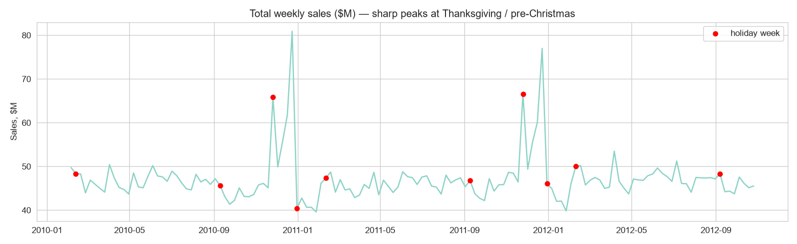

ჯამური გაყიდვები მკვეთრად სეზონურია — ორი უზარმაზარი პიკი Thanksgiving-ზე და
შობისწინა კვირაზე, თვითონ შობის კვირაში კი მკვეთრი ვარდნაა. ეს პირდაპირ
გვეუბნება, რომ კვირის ნომერი და დღესასწაულამდე მანძილი აუცილებელი ფიჩერებია -
"კვირა 51 vs კვირა 52" განსხვავება იმდენად მკვეთრია, რომ 1-კვირიანი შეცდომაც
კი კატასტროფულია, საიდანაც მოგვიანებით საშობაო შიფტის იდეაც მოდის.
ტრენდი თითქმის ბრტყელია, ამიტომ ტრენდის მოდელირება
მეორეხარისხოვანია — მთავარია სეზონურობის სწორად დაჭერა.

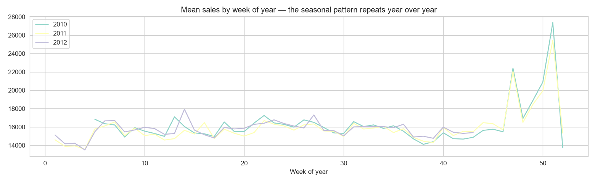

წლიდან წლამდე სეზონური შაბლონი თითქმის იდენტურად მეორდება, და ეს მთელი
პროექტის ყველაზე მნიშვნელოვანი დაკვირვებაა — ის ამართლებს lag-52 ფიჩერებს
ხეებში, 52-პერიოდიან სეზონურობას SARIMA/Prophet-ში, წილების season-aware
დესეგრეგაციას და seasonal-naive baseline-ის სიძლიერესაც (val WMAE 1,704.0,
რაც ბევრ "ჭკვიან" მოდელზეც კი უკეთესია).

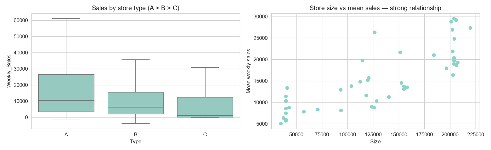

მაღაზიის ზომა (Size) გაყიდვების უძლიერესი სტატიკური პრედიქტორია, ტიპებში კი
მკაფიო იერარქიაა A > B > C — თუმცა Type ნაწილობრივ ზედმეტიცაა Size-თან ერთად
(A ტიპი უბრალოდ დიდი მაღაზიებია), რასაც feature selection-იც ადასტურებს.

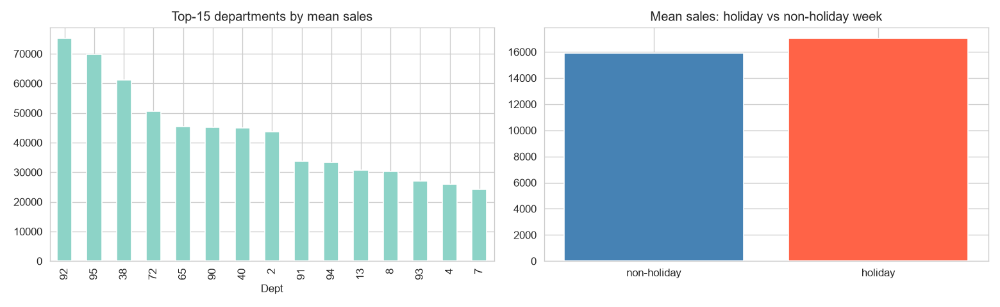

დეპარტამენტებს შორის მასშტაბის სხვაობა ~4 რიგისაა, რაც ნიშნავს, რომ global DL
მოდელს per-series სკალირება აუცილებლად სჭირდება, ხოლო ხის მოდელს Dept ID და
აგრეგატები ეყოფა. holiday კვირის საშუალო აშკარად მაღალია, თუმცა ეს საშუალო
ორი ეფექტის ნაზავია — Thanksgiving/Christmas პიკები აწევს საშუალოს, ხოლო
თვითონ შობის კვირის ვარდნა ქვევით წევს.

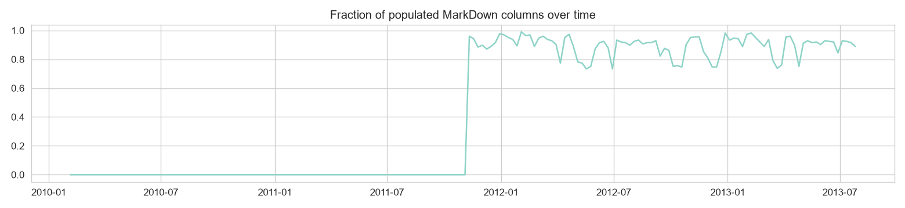

MarkDown1–5 მხოლოდ 2011 ნოემბრიდან არსებობს (ტრეინის ~64% ცარიელია), ტესტში
კი სრულადაა. ანუ მოდელს მხოლოდ ერთი Thanksgiving/Christmas აქვს ნანახი
markdown-ებით - საშიშროებაა, რომ მოდელი markdown-ს დღესასწაულის proxy-დ
გამოიყენოს და ტესტზე (სადაც markdown-ები სხვა მასშტაბისაა) გაცურდეს. ამიტომ
markdown-ების სარგებელი ცალკე FS-ექსპერიმენტით შევამოწმეთ და არა ბრმად
ჩართვით — და ორივე ხის მოდელისთვის შედეგი ერთმანეთს ეწინააღმდეგება კიდეც.

დამატებით, Cleaning რანში ილოგება კიდევ რამდენიმე რიცხვითი დაკვირვება: 1,285
სტრიქონზე გაყიდვები უარყოფითია (დაბრუნებები აჭარბებს გაყიდვებს — მასშტაბით
უმნიშვნელო, მაგრამ log-ტრანსფორმაციისას ცალკე მოვლას საჭიროებს). სერიების
9.5% კვირები გამოტოვებულია, რადგან დეპარტამენტი ყოველ კვირას არ ვაჭრობს
(DL მატრიცისთვის შევსების წესი გვჭირდება). ხოლო ტესტში 11 (Store, Dept)
წყვილი ტრეინში საერთოდ არ ჩანს, ანუ fallback აუცილებელია, თორემ submission-ში
NaN გვექნებოდა.

---

## 5. Cleaning / Preprocessing

ყოველი გადაწყვეტილება ილოგება MLflow-ის `{ARCH}_Cleaning` რანში. MarkDown1–5-ის
NaN-ს 0-ზე ვჭრით და ცალკე `MarkDown_missing` ფლაგს ვამატებთ - NaN აქ ნიშნავს
"აქცია არ ყოფილა" და არა დაკარგულ გაზომვას, ეს სტრუქტურული ნულია; მედიანით
შევსება არასწორი სემანტიკა იქნებოდა (თითქოს ყოველთვის საშუალო აქცია
მიმდინარეობდა), სვეტების გადაგდება კი ინფორმაციას დაგვაკარგვინებდა ტესტზე,
სადაც ისინი სრულადაა. CPI და Unemployment-ს per-store `ffill→bfill`-ით ვავსებთ,
რადგან ტესტის ბოლო თვეებში აკლია, მაკრო-მაჩვენებლები კი ნელა იცვლება და ბოლო
ცნობილი მნიშვნელობა საუკეთესო მიახლოებაა - გლობალური საშუალო აქ არასწორი
იქნებოდა, რადგან შტატებს შორის დონეები ძალიან განსხვავდება. უარყოფით
გაყიდვებს ხის მოდელებში ვტოვებთ (რეალური მოვლენაა, დაბრუნებები, და L1-ლოსს
არ აფუჭებს), DL-ის მატრიცაში კი 0-ზე ვჭრით, რადგან იქ სკალირება/ლოსი
სტაბილურობას ითხოვს და ეს 1,285 სტრიქონი (მთელი მონაცემების 0.3%) სერიოზულ სიგნალს
არ ქმნის. Merge ყველგან LEFT join-ითაა (train/test ← stores ← features), რომ
სტრიქონი არ დაიკარგოს. DL-ის მატრიცაში გამოტოვებულ კვირებს ნულით ვავსებთ და
არა ინტერპოლაციით — დეპარტამენტი უბრალოდ არ ვაჭრობდა, გაყიდვები ფაქტობრივად
ნულია, ინტერპოლაცია აქ გაყიდვებს გამოიგონებდა, რომლებიც არ მომხდარა.

Target-ტრანსფორმაციასთან (`log1p`) ცალსახად არ ვიჩქარეთ: log ამცირებს
right-skew-სა და დიდი სერიების დომინირებას, მაგრამ MAE-ობიექტივი
log-სივრცეში ზუსტად იგივეს არ ნიშნავს, რაც WMAE დოლარებში — წინასწარ ვერ
იტყვი, ჯობია თუ არა. ამიტომ ორივე ვარიანტი ცალკე რანში (`Loss_Target_Experiments`)
შევადარეთ და გამარჯვებული თითოეული მოდელისთვის ცალკე ავირჩიეთ.

რაც შეგნებულად არ გავაკეთეთ: აუთლაერების "მოჭრა" — holiday პიკები აუთლაერებს
ჰგავს, მაგრამ სწორედ ისინია ამოცანა, მოჭრა მეტრიკის ყველაზე ძვირ ნაწილს
დააზიანებდა; და სტანდარტიზაცია ხის მოდელებისთვის — ხეები split-ინვარიანტულია
მონოტონური ტრანსფორმაციების მიმართ, ეს ზედმეტი ნაბიჯი იქნებოდა ინფორმაციის
გარეშე.

---

## 6. ვალიდაციის სტრატეგია

### 6.1 რატომ არა ჩვეულებრივი K-Fold

Random K-Fold აქ უბრალოდ არასწორია ორი მიზეზით: მომავლის სტრიქონები ტრეინში
მოხვდებოდა და მოდელი "მომავლიდან" ისწავლიდა (leakage), და მეზობელი კვირები
ძლიერად ავტოკორელირებულია — random split-ში თითქმის იდენტური წერტილები
ტრეინშიც და ვალიდაციაშიც ხვდება და ქულა ხელოვნურად ივსება. Time-series-ში
ვალიდაცია ყოველთვის დროში წინ უნდა იყოს ტრეინის მიმართ.

### 6.2 რა ავირჩიეთ

ხეებსა და SARIMA-ში hold-out ტრეინის ბოლო 13 კვირაა (2012-08-03 - 2012-10-26),
ზუსტად ისე, როგორც ტესტი — ტრეინის ბოლოდან იწყება და შუალედში Labor Day
(w=5) ხვდება, ანუ WMAE-ს holiday-კომპონენტიც ცოცხალია. სწრაფი feedback loop
გვჭირდებოდა, რადგან ყველა FS/HPO ექსპერიმენტი სწორედ ამაზე ფასდება. ხეებზე
დამატებით 3-fold expanding-window CV გავუშვით — fold-ების val ფანჯრები [-13:],
[-26:-13], [-39:-26] კვირები, ჯამში 2012 თებერვალი–ოქტომბერი (Super Bowl-იც
შედის). ყოველ fold-ზე feature builder თავიდან იფიტება მხოლოდ იმ fold-ის
წარსულზე, ანუ აგრეგატებიდან leakage გამორიცხულია, CV კი გვაძლევს
სტაბილურობის შეფასებას (mean+-std) და იჭერს "ერთ იღბლიან ფანჯარაზე"
გადარგებას. DL-ში hold-out ბოლო 39 კვირაა, რადგან მოდელი ერთბაშად 39-კვირიან
ვექტორს აბრუნებს და ვალიდაციაც ზუსტად ამ ფორმის უნდა იყოს. გვერდითი ეფექტი
ისაა, რომ DL-ის val WMAE პირდაპირ ვერ ედრება ხეების 13-კვირიან val-ს,
შესადარებლად ხეების CV საშუალოს ვიყენებთ (რომელიც ისიც ჯამში 39 კვირას
ფარავს) და საბოლოოდ Kaggle score-ს.

### 6.3 რა ალტერნატივები განვიხილეთ და უარვყავით

Sliding window CV (ტრეინის სიგრძის ფიქსირებით) არ ავირჩიეთ, რადგან ისედაც
ცოტა ისტორია გვაქვს (143 კვირა) — ტრეინის შეკვეცა fold-ებში ხელოვნურად
ასუსტებდა მოდელს, expanding კი უფრო ახლოსაა საბოლოო რეჟიმთან. ვალიდაცია
ზუსტად 39 კვირით ხეებისთვისაც განვიხილეთ, მაგრამ მაშინ ტრეინი 104 კვირამდე
შემცირდებოდა და lag-104 თითქმის მთლიანად დაცარიელდებოდა — და
საერთოდაც, holdout-ში მაინც არ ჩნდება Thanksgiving/Christmas, ანუ სრულყოფილი
ლოკალური ვალიდაცია ამ ამოცანაზე პრინციპულად შეუძლებელია (ტესტის მთავარი
მოვლენები ტრეინის ბოლოს არ მეორდება ზუსტი ფორმით), რასაც პატიოსნად ვაფიქსირებთ
და სწორედ ამიტომ ვამბობთ, რომ საბოლოო არბიტრი Kaggle-ია. Nested CV
ჰიპერპარამეტრებისთვისაც განვიხილეთ, მაგრამ გამოთვლითად ზედმეტად ძვირი
გამოვიდოდა — ჩვენი რეჟიმი (ერთი hold-out HPO-სთვის, ცალკე CV საბოლოო
კონფიგზე) საკმარისი კომპრომისია დროის ბიუჯეტში.

---

## 7. Feature Engineering (ხის მოდელები)

ხის მოდელი დროს "ვერ ხედავს" - time-series ცხრილურ ამოცანად უნდა გადავაქციოთ
ისე, რომ ყოველი ფიჩერი ტესტის დროსაც ისეთივე წესით ითვლებოდეს, როგორც
ტრეინში. Direct-სტრატეგიიდან გამომდინარე წესი მარტივია: ფიჩერი
დასაშვებია, თუ ის პროგნოზის თარიღზე ≥39 კვირით ადრინდელ ინფორმაციას
ეყრდნობა, ან საერთოდ დეტერმინისტულია.

სულ 46 ფიჩერი გვაქვს, ოთხ ლოგიკურ ჯგუფად. პირველი ჯგუფი კალენდარულია და
სრულად დეტერმინისტული — `Year`, `Month`, `WeekOfYear` სეზონურობის ღერძია
(`WeekOfYear` ყველაზე მნიშვნელოვანია — ხე მასზე სპლიტით ფაქტობრივად
"სეზონის რუკას" აგებს), `WeekIndex` ფიქსირებული anchor-იდან გლობალურ ტრენდს
იჭერს, `Is_SuperBowl/LaborDay/Thanksgiving/Christmas` ფლაგები კი
საჭიროა იმიტომ, რომ `IsHoliday` მხოლოდ "რაღაც დღესასწაულს" ნიშნავს, მაშინ
როცა ეფექტები რადიკალურად სხვადასხვაა (Thanksgiving +100% სავარაუდოდ,
Christmas-კვირა კი −20%-მდე ვარდნა). `DaysTo_*` მანძილს ზომავს უახლოეს
დღესასწაულამდე და "მოახლოების" ეფექტს იჭერს (შობისწინა აჩქარება რამდენიმე
კვირით ადრე იწყება, ბინარული ფლაგი ამას ვერ ხედავს), ხოლო `Pre_Christmas_Days`
— რამდენი დეკემბრის 15-24 დღე ხვდება კვირის ფანჯარაში — პროექტის ერთ-ერთი
ყველაზე ღირებული დაკვირვებაა: კვირის საზღვრები წლიდან წლამდე ინაცვლებს და
51-ე/52-ე კვირაში სხვადასხვა რაოდენობის "საშობაო" დღე ხვდება, რასაც lag-52
ვერასოდეს დაინახავს.

მეორე ჯგუფი მაღაზიის სტატიკური ატრიბუტებია — `Size`, `Type` (one-hot), `Store`
და `Dept` (როგორც მთელი რიცხვი). მესამე ჯგუფი ეკონომიკა/აქციებია
(`Temperature`, `Fuel_Price`, `CPI`, `Unemployment`, `MarkDown1–5`,
`MarkDown_sum`, `MarkDown_missing`) - features.csv-ში ეს ტესტზეც მოცემულია.
აპრიორი ველოდებოდით, რომ მაკრო-სვეტები სუსტი იქნებოდა (კვირეულ ჭრილში ისინი
თითქმის მუდმივებია და მათი ეფექტი Store-ის ID-შივეა "ჩაშენებული"), და ეს
ჰიპოთეზა ცალკე FS-სეტით (`no_econ`) შევამოწმეთ და არა ვარაუდით დავტოვეთ.
მეოთხე, ყველაზე ძლიერი ჯგუფი ისტორიაა: `Lag_52`/`Lag_52_prev`/`Lag_52_next`/
`Lag_52_roll3` შარშანდელ იმავე კვირას იჭერს +-1 კვირით (ეს ორ პრობლემას
აგვარებს ერთდროულად - კალენდრის წანაცვლებას და single-point ხმაურს),
`Lag_104` მეორე სეზონურ წერტილს იძლევა, `SD_WOY_Mean` — (Store, Dept,
WeekOfYear)-ის საშუალოს ყველა წელზე, `SD_Recent13` კი სერიის მიმდინარე
დონეს (lag-52-თან წყვილში ხე "დონის შეცვლასაც" იჭერს, მაგალითად, თუ
დეპარტამენტი გაფართოვდა). `Expected`-ისა და `Lag52_missing`-ის ფლაგის
ჯაჭვი - `SD_WOY, SD_Median, Dept_WOY, Dept_Mean, global` — ტესტის 11
უცნობი წყვილისა და ცარიელი ლაგებისთვის საჭირო fallback-ია.

კატეგორიულებში `Store`-სა (45) და `Dept`-ს (81) პირდაპირ მთელ რიცხვად
ვაქცევთ და არა one-hot-ად - ხის მოდელისთვის ID-ზე split სავსებით
ლეგიტიმურია (თანმიმდევრული split-ებით ის ნებისმიერ ქვესიმრავლეს გამოყოფს),
ხოლო one-hot 81 თითქმის ცარიელ სვეტს შექმნიდა და split-ებსაც დაფრაგმენტებდა.
`Type`-ს (3 მნიშვნელობა) კი one-hot ვუკეთებთ, რადგან იაფია. Target encoding-იც
განვიხილეთ, მაგრამ ფაქტობრივად უკვე გვაქვს უკეთესი, leakage-კონტროლირებადი
ფორმით: `SD_Mean`, `Dept_Mean` და მსგავსი აგრეგატები ზუსტად target encoding-ია,
ოღონდ fit/transform განცალკევებით (მხოლოდ ტრეინის წარსულზე ითვლება).

რამდენიმე იდეა შეგნებულად არ გამოვიყენეთ. მოკლე ლაგები (lag-1, lag-4,
rolling-4) - Direct-სტრატეგიაში ტესტზე უბრალოდ არ არსებობს, მათი დამატება
ვალიდაციას გააუმჯობესებდა და ტესტს გაანადგურებდა. გარე მონაცემები -
შეჯიბრის წესები პირდაპირ კრძალავს მოწოდებული დატის მიღმა რაიმეს გამოყენებას.
ურთიერთქმედების ხელით აგება (მაგალითად Size×WeekOfYear) — ხის მოდელი
interaction-ებს თავად აგებს split-ების კომბინაციით, ხელით აგება მხოლოდ
წრფივ მოდელებს სჭირდება. ფურიეს წევრები ხეებისთვისაც განვიხილეთ, მაგრამ
ხეები გლუვ სინუსოიდებს ისედაც საფეხურებად ჭრიან — `WeekOfYear` პლუს
აგრეგატები იმავე ინფორმაციას უფრო "ხის ენაზე" აძლევს. Dept-ების
კლასტერიზაცია/ემბედინგი საინტერესო იდეა იყო, მაგრამ აგრეგატები იმავე
მსგავსობას უფრო მარტივად იჭერს და დროის ბიუჯეტში არ ჩავდეთ.

მთელი FE `WalmartFeatureBuilder`-შია შეფუთული (`preprocessing.py`), sklearn-
ტრანსფორმერის სახით — ორივე ხის ნოუთბუქი ზუსტად ერთსა და იმავე კლასს
იმპორტავს. `fit(X, y)` იმახსოვრებს ისტორიას, აგრეგატებს და side-ცხრილებსაც
(features.csv, stores.csv), `transform(X)` კი მხოლოდ დაუმუშავებელ
`[Store, Dept, Date, IsHoliday]` სტრიქონებს იღებს. `log_model`-ისას მოდული
`code_paths`-ით მოდელს თან მიჰყვება, ამიტომ Registry-დან ჩატვირთვას ეს
ფაილი ცალკე არ სჭირდება - ეს არა მხოლოდ დავალების მოთხოვნაა (Pipeline raw
ტესტზე), არამედ leakage-ის კონტროლიც: ვალიდაციისას/CV-ისას builder ყოველთვის
მხოლოდ შესაბამის წარსულზე იფიტება.

---

## 8. Feature Selection

ფიჩერ-სელექციის ბევრი კლასიკური მეთოდი განვიხილეთ. Variance threshold ჩვენს 46 ფიჩერში
ვერაფერს გვაძლევს, რადგან თითქმის მუდმივი სვეტი არ გვაქვს (ხელით ავაგეთ
ყველა). Correlation filter წრფივი მოდელების იარაღია — ხეებს მაღალი
კორელაცია არ აწუხებთ, ხე კორელირებულებიდან ერთს ირჩევს ისედაც. Mutual
information უნივარიატულია და ვერ ხედავს ურთიერთქმედებებს, რაც ხის მოდელის
მთავარი ძალაა. RFE 46 ფიჩერზე × LightGBM refit-ებით ძვირი და არასტაბილური
იქნებოდა. Permutation importance კარგი მეთოდია, მაგრამ კორელირებულ ჯგუფებში
(ჩვენი ლაგები/აგრეგატები) importance-ს ჯგუფის წევრებზე შლის და თითოეულს
ხელოვნურად ანულებს.

ამის ნაცვლად ორ მეთოდზე შევჩერდით. პირველი - ჯგუფური აბლაცია: მთელი
ლოგიკური ჯგუფი (markdown, მაკრო, ისტორია) ერთად ირთვება/ითიშება და ფასდება
ვალიდაციაზე. ეს ჩვენი ფიჩერების ბუნებრივ სემანტიკურ ჯგუფებს ემთხვევა და
პასუხობს რეალურ კითხვას - "გვჭირდება თუ არა markdown-ები საერთოდ?" - და
კორელაციის პრობლემასაც გვერდს უვლის. მეორე - embedded (gain) importance
top-K: LightGBM-ის დაგროვილი gain-ით ტოპ-25 ფიჩერი, იაფი (მოდელი ისედაც
გვჭირდება) და ურთიერთქმედებებსაც ითვალისწინებს.

ხუთივე კანდიდატი ერთსა და იმავე default მოდელზე და ერთსა და იმავე hold-out-ზე
შევადარეთ, LightGBM-ისთვისაც და XGBoost-ისთვისაც ცალკე. LightGBM-ისთვის
ყველა ფიჩერით (46) 1,633.6 გამოვიდა, markdown-ების მოხსნით (39 ფიჩერი)
თითქმის არაფერი შეიცვალა - 1,635.8, მაკრო-ბლოკის მოხსნით (42) ცოტა
გაუარესდა - 1,657.1, მხოლოდ დროით/ისტორიულ ფიჩერებზე (35) კიდევ ცოტა მეტი -
1,667.4, ხოლო gain-ით ტოპ-25-მა ყველაზე კარგი შედეგი მოგვცა — 1,615.0,
ანუ ნახევარი ფიჩერით უკეთესი ან თანაბარი ქულა. LightGBM-მა საბოლოოდ ეს
top-25 სეტი აირჩია. XGBoost-ისთვის სურათი ოდნავ განსხვავებულია: ყველა
ფიჩერმა (1,602.7) სცადა საუკეთესო, markdown-ების მოხსნამ თითქმის არაფერი
შეცვალა (1,605.0), მაკრო-ბლოკის (1,630.0) და მხოლოდ დროითი ფიჩერების
(1,625.7) მოხსნამ ცოტა გააუარესა, ხოლო top-25-მა XGBoost-ისთვის სისტემით
ყველაზე ცუდი შედეგი გამოიღო - 1,656.8. XGBoost საბოლოოდ სრულ 46-ფიჩერიან
სეტს დარჩა ერთგული.

ეს განსხვავება - LightGBM-ს ნაკლები ფიჩერი სჯობს, XGBoost-ს მეტი - თავისთავად
საინტერესო დასკვნაა და შემთხვევითი არ ჩანს: LightGBM-ის leaf-wise ზრდა
ბევრად უფრო აგრესიულად "იჭერს" ცალკეულ ფიჩერებს და ცოტა, მაგრამ ხარისხიან
სიგნალზეც კარგად მუშაობს, XGBoost-ის კონსერვატიული level-wise ზრდა კი
სარგებელს პატარა, დამატებით სუსტ სიგნალშიც პოულობს და ფიჩერების მოჭრით
ინფორმაციის ნაწილს კარგავს. ორივესთვის ცხადია ერთი რამ: markdown-ების
მოხსნა თითქმის არაფერს ცვლის (1-2 ქულა), რაც ადასტურებს ჩვენს EDA-ს
ეჭვს - markdown-ის ისტორია ისედაც ძალიან მოკლეა (მხოლოდ 2011 ნოემბრიდან)
და მისი რეალური სარგებელი მინიმალურია.

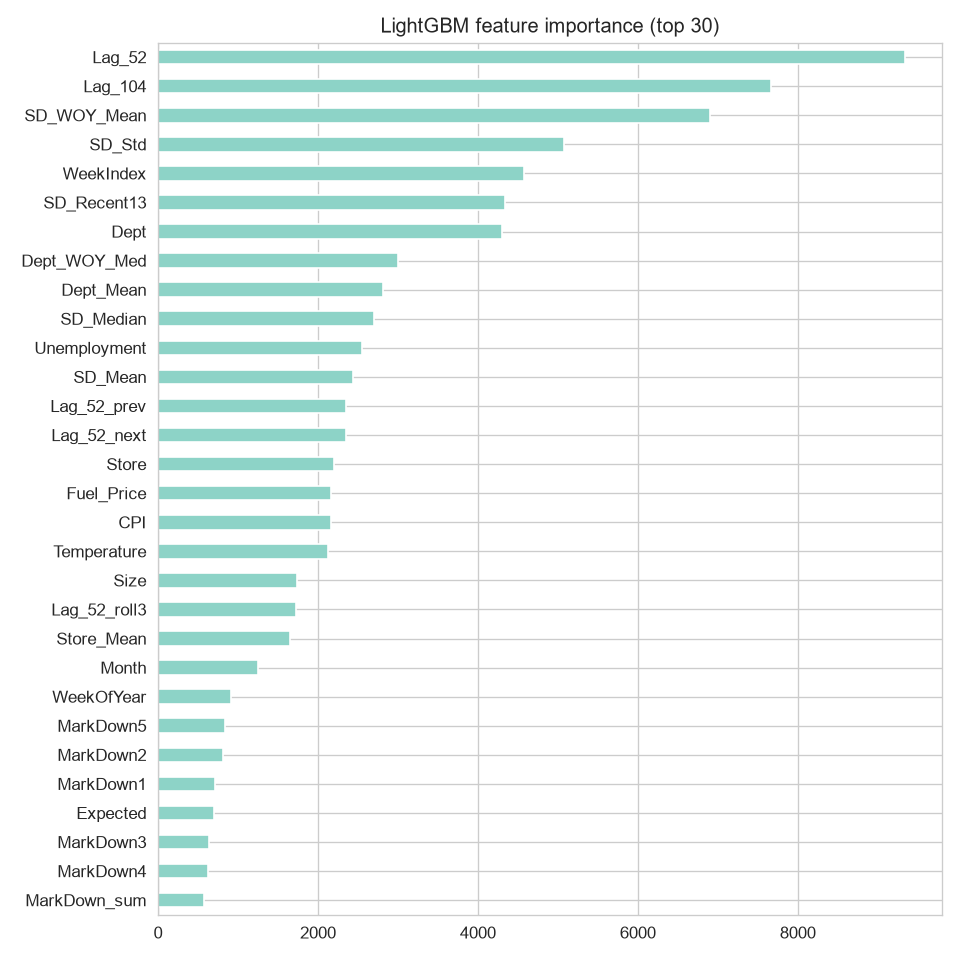

LightGBM-ის gain importance-ის ტოპში მოსალოდნელისამებრ ისტორიული აგრეგატები
დომინირებს - lag-52-ის მიმდებარე ვერსიები და (Store, Dept, WeekOfYear)
საშუალოები - რაც ადასტურებს მთავარ ჰიპოთეზას: სიგნალის ლომის წილი
ისტორიის ჯგუფშია და არა მაკრო-ცვლადებში.

---

## 9. ჰიპერპარამეტრების ტუნინგის მეთოდოლოგია

ძებნის ალგორითმებიდან grid search ექსპონენციურად ფეთქდება განზომილებასთან
ერთად და 7-8 პარამეტრზე უბრალოდ არარეალურია, random search ამაზე უკეთესია
მაღალ განზომილებაში , მაგრამ წარსულ ცდებს არაფერს სწავლობს.
ჩვენ Bayesian/TPE ძებნა ავირჩიეთ Optuna-ს საშუალებით
ხის მოდელებზე. ყოველი ახალი ტრიალი წინა შედეგების განაწილებიდან ირჩევა და
იმავე ბიუჯეტში სისტემატურად უკეთეს კონფიგებს პოულობს, ვიდრე grid ან random.
DL-ში კი განსხვავებული მიდგომა ავირჩიეთ - ხელით შერჩეული, ჰიპოთეზებზე
აგებული კონფიგები, პლუს ბონუს-რეჟიმად WandB-ის Bayesian sweep (`RUN_SWEEP=True`).
ამის მიზეზი მარტივია: დავალების მთავარი შეფასების კრიტერიუმი უცნობი
არქიტექტურის გაგებაა. Sweep ბრმად პოულობს კარგ წერტილს, მაგრამ ვერ პასუხობს
კითხვებს "რას იძლევა RevIN?", "interpretable ბაზისი სჯობს თუ generic?",
"capacity შველის თუ არა?" — ამიტომ DL-ში 6 კონფიგი თითო არქიტექტურაზე
აბლაციებადაა აგებული (თითო კონფიგი ერთ კითხვას პასუხობს), sweep კი ბონუსად
ზის ზემოთ.

`n_estimators`-ს ხეებში საერთოდ არ ვეძებთ Optuna-ში — early stopping (150
რაუნდი weighted-MAE-ზე) თავად პოულობს ოპტიმალურ წერტილს ყოველი კონფიგისთვის,
ეს ერთი "უფასო" ჰიპერპარამეტრია და ძებნის სივრცის ერთი განზომილებით
შემცირებაცაა. საბოლოო full-data ფიტზე კი `n_estimators = best_iter × 1.1`-ს
ვიყენებთ - მეტ მონაცემზე ცოტა მეტი იტერაცია სტანდარტული პრაქტიკაა, რადგან
full-fit-ზე ვალიდაცია აღარ გვაქვს ცალკე (ის უკვე ტრეინშია ჩაბრუნებული).

LightGBM-ის 7-განზომილებიან სივრცეში `learning_rate` (0.02–0.15,
ლოგარითმული) ნაბიჯის ზომას აკონტროლებს, `num_leaves` (31–511) — ხის
სირთულეს leaf-wise ზრდაში, ეს არის მთავარი capacity-ბერკეტი. `min_child_samples`
(5–100) - ფოთლის მინიმალურ ზომას, პატარა ფოთლები ხმაურს იზეპირებენ;
`feature_fraction`/`bagging_fraction` (0.6–1.0) — სვეტებისა და სტრიქონების
ქვესემპლირებას, RF-ისეული დეკორელაციის იდეით; `lambda_l1`/`lambda_l2`
(1e-8–10) კი წონების რეგულარიზაციას split-ის გეინში. 30 ტრიალის შემდეგ
საუკეთესო კონფიგი (trial #22) 1,536.2 val WMAE-ს იძლევა, პარამეტრებით
`learning_rate=0.068`, `num_leaves=98`, `min_child_samples=60`,
`feature_fraction=0.60`, `bagging_fraction=0.86`. XGBoost-ის 8-განზომილებიან
სივრცეში დამატებით არის `max_depth` (5–11, level-wise-ში სიღრმეა
capacity-ბერკეტი და არა ფოთლების რაოდენობა), `min_child_weight` (Hessian-ის
მინიმალური მასა ფოთოლში) და `gamma` (split-ის მინიმალური გეინი — pruning).
30 trial-ის საუკეთესო (trial #16) 1,533.3 val WMAE-ს იძლევა, `learning_rate=0.079`,
`max_depth=9`, `min_child_weight=26.8`, `subsample=0.86`,
`colsample_bytree=0.50`, `gamma=2.86`. საინტერესოა, რომ XGBoost-მა ღრმა
ხეები აირჩია (depth=9) — level-wise ზრდის კონსერვატიულობის საწინააღმდეგოდ
კომპენსაციაა, სავარაუდოდ, ხოლო LightGBM-ის num_leaves=98 შედარებით
ზომიერი კომპლექსურობაა 511-მდე დიაპაზონში - ორივე ერთმანეთისგან
დამოუკიდებლად თითქმის ერთნაირ საბოლოო ქულაზე გავიდა (1,526–1,533), მიუხედავად
სულ სხვანაირი "აზროვნების სტილისა". ორივეგან ყოველი trial ცალკე nested
MLflow რანად ილოგება, ანუ ძებნის მთელი ტრაექტორია რეპროდუცირებადია.

---

## 10. არქიტექტურები და ექსპერიმენტები

### 10.0 Baseline — Seasonal Naive

პროგნოზი უბრალოდ შარშანდელი იგივე კვირაა (`Lag_52`, fallback-ით). ნებისმიერი
forecasting პროექტი ამით უნდა იწყებოდეს - ეს არის ის ზღვარი, რომლის ქვემოთაც
ნებისმიერი "ჭკვიანი" მოდელი უბრალოდ ზიანია. სეზონური naive ჩვენს
13-კვირიან ვალიდაციაზე 1,704.0 WMAE-ს იძლევა, ხოლო (Store, Dept, WOY)
საშუალო - 1,796.9. ორივე კარგადაა, სეზონურობა თითქმის იდეალურად მეორდება
ამ დატაზე, ტოპ Kaggle solution-ები ისტორიულად ~2,300-2,500-იან WMAE-ს
აჯობებდნენ - ანუ "ჭკუის" მთელი ფასი აქ ~20-25%-ია, არც თუ ისე ბევრი.

### 10.1 SARIMA

**თეორია.** ARIMA(p,d,q) = AR (ინერცია: წინა p მნიშვნელობის წრფივი
კომბინაცია) + I (d-ჯერადი წარმოება სტაციონარობისთვის) + MA (წინა q
შოკის კორექცია). SARIMA ამატებს იმავე სტრუქტურას სეზონურ ლაგებზე (m=52).
ADF-ტესტმა დაადასტურა, რომ ჯამური სერია წარმოების გარეშე არასტაციონარულია,
ერთჯერადი წარმოების შემდეგ კი სტაციონარული ხდება — სტანდარტული
სურათი, ACF-ის სპაიკიც ზუსტად lag-52-ზეა, რაც წლიურ სეზონურობას ადასტურებს.

**კრიტიკული პრაქტიკული პრობლემა m=52-თან.** სეზონური წარმოება 143
კვირიდან 52-ს "ჭამს", სეზონური პარამეტრები კი მხოლოდ ~2 ციკლზე ფიტდება —
ნელა და არასტაბილურად. ამის სახელმძღვანელო ალტერნატივაა dynamic harmonic
regression: ARIMA + ფურიეს sin/cos რეგრესორები exog-ად, სადაც სეზონურობა
დეტერმინისტული ხდება და ARIMA მხოლოდ მოკლე დინამიკას იჭერს. ორივე
ვარიანტი ჯერ ჯამურ სერიაზე შევადარეთ: SARIMA(1,1,1)×(0,1,1,52)-ს AIC=741.9
აქვს, ARIMA+Fourier ვარიანტებს კი AIC 4233-4277-ის დიაპაზონში — თუმცა ეს
რიცხვები პირდაპირ არ ედრება ერთმანეთს, რადგან SARIMA ორმაგად წარმოებულ
სერიაზეა ფიტირებული (ჩვეულებრივი + სეზონური), ARIMA+Fourier კი მხოლოდ
ერთჯერადად — სხვადასხვა დამოკიდებული ცვლადზეა გამოთვლილი AIC და მათი
პირდაპირი შედარება კლასიკური მარტივი, მაგრამ ხშირი შეცდომაა. ამიტომაც
საბოლოო არჩევანს არა მარტო AIC-ს, არამედ ჯამურ WMAE-საც ვამოწმებთ — და
სწორედ აქ ჩანს საინტერესო სურათი: SARIMA(1,1,1)×(0,1,1,52) 726,641-იან
ჯამურ შეცდომას იძლევა, ARIMA+Fourier ვარიანტები კი 1.3-1.5 მილიონამდე
გაცილებით უარესია - ანუ სრული სეზონური დიფერენცირება აქ რეალურადაც სჯობს
ფურიეს მიახლოებას, უბრალოდ ბევრად ნელია (13.5 წამი ჯამურ სერიაზე vs
0.9-1.9 წამი Fourier ვარიანტებზე).

**რატომ store-level + დესეგრეგაცია.** Per-series მიდგომა (3,331 ცალკე ფიტი)
ძვირი იქნებოდა და sparse სერიებზე SARIMA უბრალოდ ინგრევა, ერთი ჯამური
სერიის წილებზე დაშლა კი ზედმეტად უხეშია — მაღაზიების ინდივიდუალური დინამიკა
დაიკარგებოდა. ამიტომ 45 store-დონის მოდელი ავაშენეთ და დეპარტამენტების
წილებზე დავშალეთ, სადაც წილი კვირის ნომერზეცაა დამოკიდებული (დეპარტამენტების
წილი სეზონურად ძლიერ იცვლება - სათამაშოები დეკემბერშია, არა ივნისში).

**ექსპერიმენტები და შედეგები.** 45 store-დონეზე 4 კონფიგი შევადარეთ,
ვალიდაციაზე დისაგრეგირებული WMAE-თი: `fourier_K4` - 1,674.5 (10 წამში),
`fourier_K8` - 1,639.3 (18 წამში), `ARIMA(2,1,2)+Fourier K8` - 1,627.7 (28
წამში), და სრული `SARIMA(1,1,1)×(0,1,1,52)` — 1,538.9, მაგრამ 533 წამში,
ანუ დაახლოებით 20-50-ჯერ უფრო ნელი, ვიდრე ფურიეს ალტერნატივები. საბოლოოდ
სიზუსტე სიჩქარეს ვამჯობინეთ და `sarima_m52`-ზე შევჩერდით, თუმცა ეს
ნამდვილი trade-off-ია, რომელიც უფრო დიდ დატაზე (ან უფრო მკაცრ დროის
ბიუჯეტში) სხვანაირად გადაწყდებოდა.

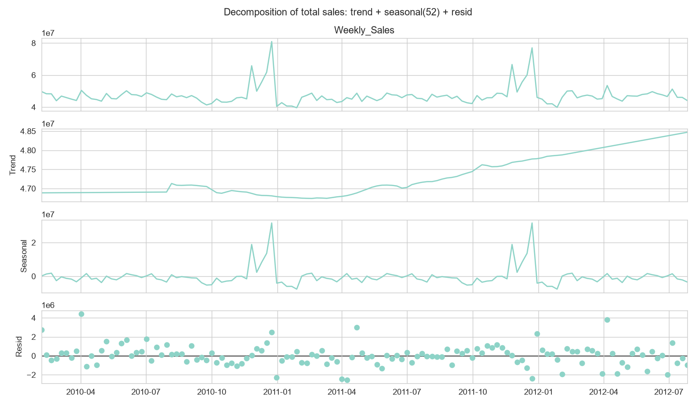
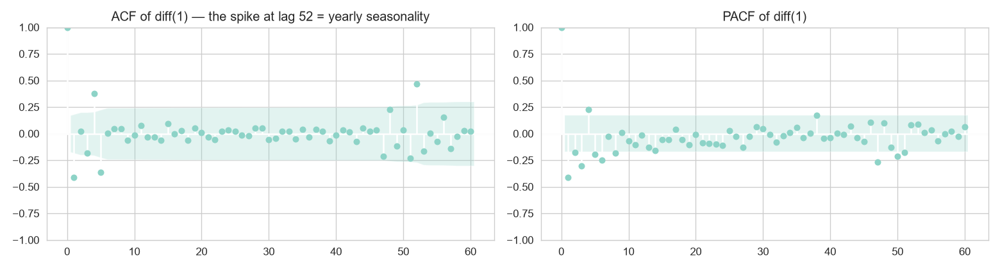
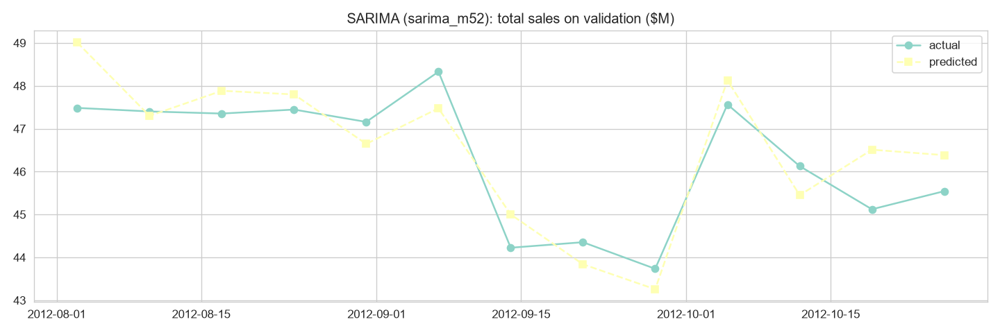

საბოლოოდ SARIMA (1,538.9) ხეებთან (1,526-1,533) თითქმის თანაბარია, რაც
გვაჩვენებს, რომ ამ კონკრეტულ ამოცანაზე — სადაც სეზონურობა ასე ძლიერი და
სტაბილურია — კარგად აწყობილი კლასიკური მოდელი მართლაც კონკურენტულია
თანამედროვე ML-თან, თუმცა ხის მოდელების ეგზოგენური ფიჩერების (Size,
markdown, ეკონომიკა) გამოყენების უნარი მაინც ოდნავ წინ სვამს მათ. სადაც
top-down მიდგომა ნამდვილად "იტყდება" — ინდივიდუალური დეპარტამენტის
ანომალიები (მაგალითად, ერთი კონკრეტული Dept-ის ლოკალური აქცია) წილებში
საშუალდება და იკარგება, რასაც global ხის მოდელი Dept ID-ის საშუალებით
პირდაპირ ხედავს.

### 10.2 Prophet

**თეორია.** `y(t) = g(t) + s(t) + h(t) + ε` — piecewise-linear ტრენდი
ავტომატური changepoint-ებით, ფურიეს სეზონურობა (დეტერმინისტული, სეზონური
დიფერენცირება არ სჭირდება), holiday-რეგრესორები +-ფანჯრით, MAP-ფიტი Stan-ში.

**ექსპერიმენტები.** ხუთი კონფიგი შევადარეთ, თითოეული — კონკრეტული კითხვის
პასუხად. საბაზო ვერსია (cps=0.05, additive, holidays ±7 დღით) 2,068.6
val WMAE-ს იძლევა. მოქნილი ტრენდით (cps=0.5) ვცადეთ - 2,370.4, overfit-ის
ნიშანია. Multiplicative სეზონურობით (სეზონურობა დონის პროპორციულია და არა
აბსოლუტური) 2,065.6 გამოვიდა — უმნიშვნელოდ, მაგრამ სისტემატურად უკეთესი
საბაზოზე, რაც გასაგებია: მაღაზიის ზომასთან ერთად სეზონური ვარდნა/აწევაც
პროპორციულად იზრდება. ყველაზე ინფორმატიული აბლაცია - holiday-რეგრესორების
მთლიანად მოხსნა - 2,572.0-მდე აუარესებს, ანუ დღესასწაულების ცოდნა თითქმის
500 ქულას (~24%) გვაძლევს ამ მეტრიკაზე, სადაც holiday კვირები 5x იწონის —
ეს ერთ-ერთი ყველაზე ღირებული რიცხვია მთელ პროექტში, პირდაპირ ადასტურებს
Prophet-ის არჩევანის მთავარ არგუმენტს. ბოლოს, სეზონურობის ჰარმონიკების
გაზრდამ 20-მდე (yearly_order=20, "უფრო კუთხოვანი" პროფილის მოლოდინით)
დრამატულად დააზარალა შედეგი — 4,128.5, ანუ ორჯერ უარესი საბაზოზე. ეს
კლასიკური overfitting-ია: ამდენი ჰარმონიკა ორ სრულ სეზონურ ციკლზე
თავისუფლად "იმახსოვრებს" ტრეინის ხმაურსაც და არა რეალურ პატერნს.

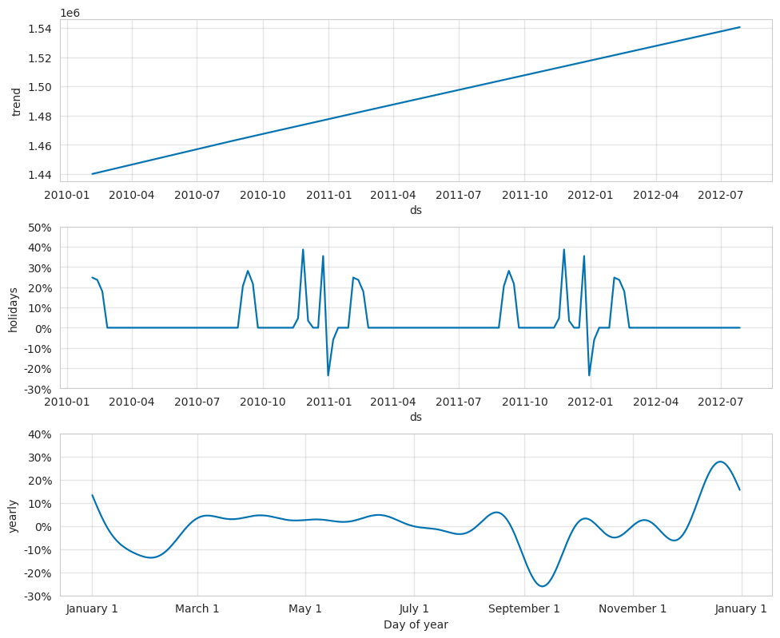
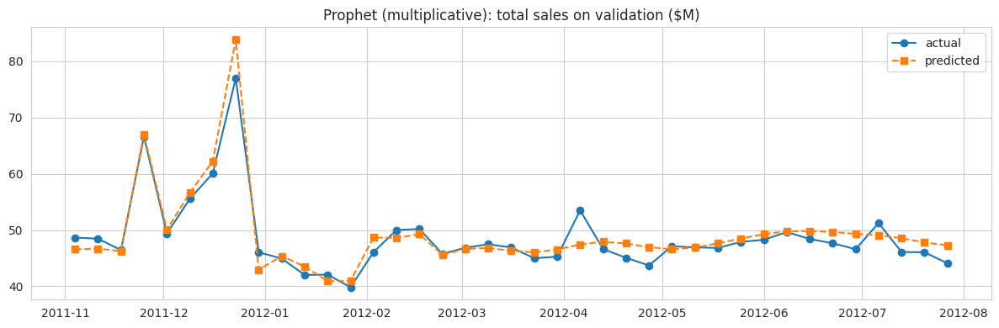

საბოლოო არჩევანი — multiplicative, 2,065.6 val WMAE. SARIMA-სთან (1,538.9)
შედარებით Prophet აშკარად ჩამორჩება, თუმცა, როგორც აღვნიშნეთ,
ეს შედარება მთლად სამართლიანი არ არის: Prophet-ის ვალიდაცია ერთადერთია
მთელ პროექტში, სადაც ნამდვილი Thanksgiving/Christmas ხვდება, ანუ Prophet-ს
რეალურად უფრო რთული ამოცანა ჰქონდა შესაფასებელი. მიუხედავად ამისა, Prophet-ის
დესეგრეგაციის იგივე shared მექანიზმი (`StoreShareForecastPipeline`,
`models.py`) აქაც იმავე შეზღუდვას განიცდის, რასაც SARIMA — დეპარტამენტის
ინდივიდუალური მოვლენები წილებში იშლება.

### 10.3 LightGBM

**თეორია.** Gradient boosting ხეების თანმიმდევრობაა, სადაც ყოველი შემდეგი
წინა ანსამბლის ლოსის ანტიგრადიენტს (L1-ისთვის — შეცდომის ნიშანს) უფიტდება.
LightGBM-ის სპეციფიკაა ჰისტოგრამული split-ძებნა (უწყვეტი ფიჩერი → 255 ბინი)
და leaf-wise ზრდა — ყოველ ნაბიჯზე ის ფოთოლი იხლიჩება, რომელიც ლოსს ყველაზე
მეტად ამცირებს, რაც იმავე ფოთლების ბიუჯეტში უფრო ღრმა, ასიმეტრიულ ხეებს
იძლევა, ვიდრე level-wise ზრდა.

**ექსპერიმენტების ჯაჭვი და შედეგები.** EDA/Cleaning/Feature Engineering
შემდეგ, საბაზისო seasonal naive-ის (1,704.0) გავლის შემდეგ,
ხუთი feature-სეტიდან top-25 (gain importance) 1,615.0-ით საუკეთესო
აღმოჩნდა. ამის თავზე 30-trial-იანმა Optuna-ს ძებნამ 1,536.2-მდე
დაიყვანა val WMAE. Loss/target-ის 2×2 აბლაციამ საინტერესო რამ
აჩვენა - holiday-წონების გამორთვამ სინამდვილეში ოდნავ გააუმჯობესა შედეგი
(1,526.2 წონების გარეშე vs 1,536.2 წონებით), მაშინ, როცა ჩვენი მთელი
თეორიული არგუმენტი  წონების სასარგებლოდ იყო. ეს ეწინააღმდეგება
ინტუიციას, მაგრამ ახსნა მარტივია: ჩვენს 13-კვირიან ვალიდაციაში მხოლოდ
ერთი holiday-კვირაა (Labor Day) და მისი წონის 5-ჯერ გამრავლება იმდენად მცირე
ნიმუშზეა დაფუძნებული, რომ შემთხვევითობის ფარგლებშივე ტრიალებს - ეს
ზუსტად ის შემთხვევაა, რომელიც გვასწავლის, რომ თეორიულად "სწორი" ტექნიკის
ემპირიულ გადამოწმებას ყოველთვის აქვს აზრი. საბოლოოდ log_target-ის გარეშეც
დავრჩით (log-ტრანსფორმაცია ორივე კომბინაციაში ოდნავ აუარესებდა).
3-fold expanding CV-მ 1,996.4 +- 561.9 მოგვცა, სადაც პირველი fold (ზუსტად
hold-out ფანჯარა) 1,526.2-ია, მეორე — 1,676.7, მესამე კი (რომელშიც Super
Bowl ხვდება) - 2,786.3, ანუ ყველაზე რთული fold ზუსტად ისაა, სადაც
დამატებითი holiday-ივენთია და feature builder-საც ყველაზე ნაკლები ისტორია
აქვს დაფიტვისთვის. საბოლოო refit-ის შემდეგ (541 ხე) საბოლოო val WMAE
1,526.2-ია — ეს არის საერთო ჯამში საუკეთესო ციფრი მთელ პროექტში ლოკალურ
ვალიდაციაზე. საბოლოო გამარჯვებული Kaggle-მა გადაწყვიტა.

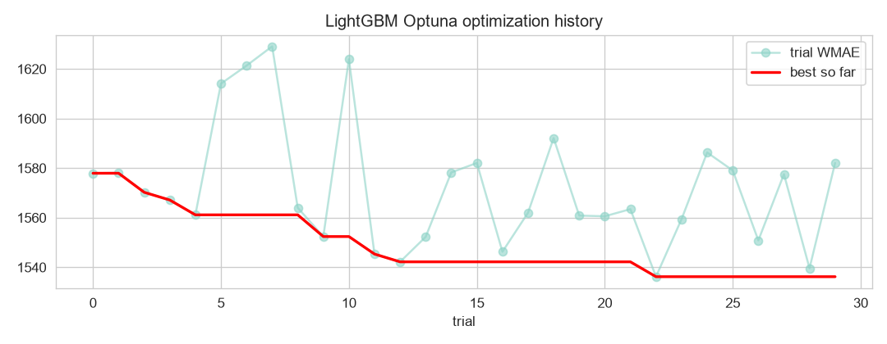
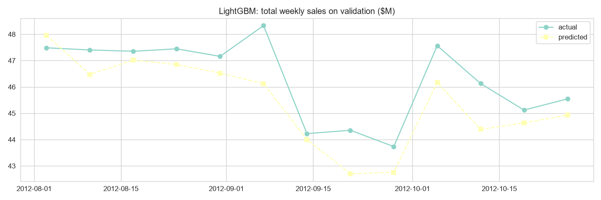
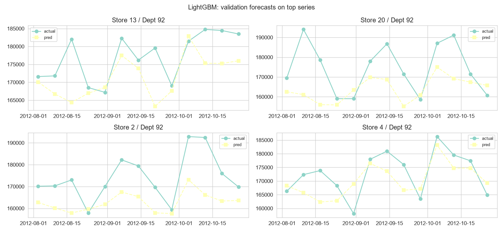

### 10.4 XGBoost

**რით განსხვავდება LightGBM-ისგან.** Level-wise ზრდა (ხე დონეებად ივსება,
უფრო სიმეტრიული/კონსერვატიულია), split-ის გეინი მეორე რიგის (Hessian)
აპროქსიმაციით ითვლება (ობიექტივის უფრო ზუსტი ლოკალური მოდელი),
რეგულარიზაცია ობიექტივშივეა ჩაშენებული (γ - split-ის ფასი, α/λ - ფოთლის
წონებზე), `tree_method="hist"` კი იგივე ჰისტოგრამული აჩქარებაა.

**შედეგები.** ექსპერიმენტების ჯაჭვი იდენტურია. Feature selection-ში
XGBoost-მა LightGBM-ისგან განსხვავებით სრული 46-ფიჩერიანი სეტი აირჩია
(1,602.7 - თავად ეს საბაზო რიცხვიც უკვე LightGBM-ის საბაზო FS-ქულაზე
(1,633.6) უკეთესია). 30-ტრიალიანმა Optuna-მ
1,533.3-მდე დაიყვანა, `max_depth=9`-ის მნიშვნელოვნად ღრმა არჩევანით.
Loss/target-ის აბლაციაში LightGBM-ისგან განსხვავებით წონებმა აქ მართლაც
უშველა (1,533.3 წონებით vs 1,534.3 მათ გარეშე) - თუმცა სხვაობა ისევ
მინიმალურია, იგივე მცირე-ნიმუშის მიზეზით. 3-fold CV-მ 1,933.4 +- 441.3
მოგვცა (fold-ები: 1,533.3 / 1,718.7 / 2,548.3), რაც LightGBM-ის CV-საზე
(1,996.4 +- 561.9) ოდნავ სტაბილურიცაა - დაბალი std და უკეთესი
worst-case fold, მიუხედავად იმისა, რომ LightGBM-ის ერთჯერადი საბოლოო
val WMAE (1,526.2) ოდნავ სჯობს XGBoost-ის (1,533.3). ეს ნამდვილი
trade-off-ია, რომელსაც საბოლოო არჩევანში ცალკე განვიხილავთ. ეს trade-off
საბოლოოდ XGBoost-ის სასარგებლოდ გადაწყდა

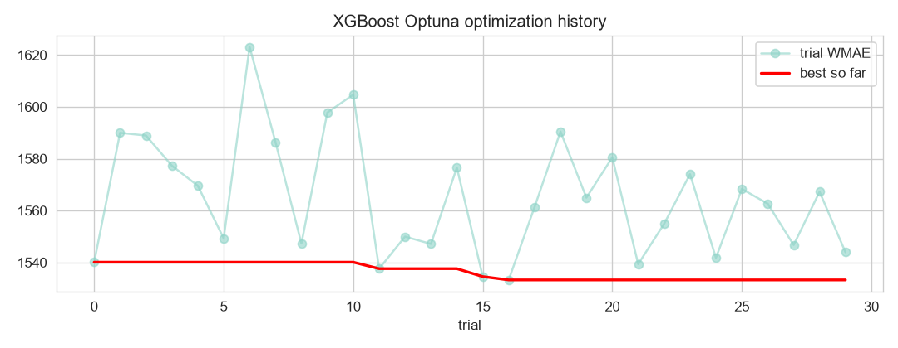
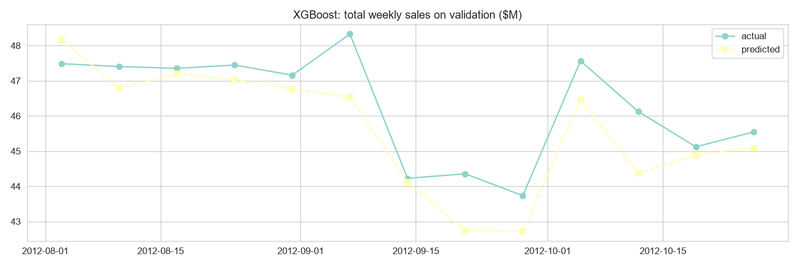

### 10.5 N-BEATS

**თეორია.** ქსელი ბლოკების ჯაჭვია. ყოველი ბლოკი input-ფანჯრიდან აგებს
backcast-ს (ინფუთის ის ნაწილი, რომელიც "ახსნა") და forecast-ს (წვლილი
პროგნოზში). Doubly-residual stacking-ის მიხედვით შემდეგ ბლოკს გადაეცემა
`input − backcast` - ყოველი ბლოკი წინების აუხსნელ ნარჩენზე მუშაობს (ეს
boosting-ის პირდაპირი ანალოგია ნეირონულ ენაზე). Generic ბაზისი
backcast/forecast-ს თავისუფალ წრფივ პროექციად აყენებს, interpretable
ბაზისი კი აიძულებს იყოს პოლინომიალური ტრენდი + ფურიეს ჰარმონიკები
პერიოდით 52 - ანუ მოდელი დეკომპოზიციას გვაძლევს.

**საერთო DL setup.** სამივე DL ნოუთბუქში იდენტურია, რომ შედარება პატიოსანი
იყოს — global მოდელი 3,331 სერიაზე, per-series mean-სკალირება, sliding
window-ები, weighted-L1 loss, Adam, early stopping ვალიდაციის დოლარებში
დათვლილ WMAE-ზე (და არა scaled loss-ზე, რომ გაჩერების კრიტერიუმიც
მეტრიკას ემთხვეოდეს).

**შედეგები.** ხუთი კონფიგი შევადარეთ. საწყისი generic (3 სტეკი, 256
სიგანე, 4 სიღრმე) 3,229.8-ზე გაჩერდა. Capacity-ს გაზრდამ (4×512×4, ~3.4
მილიონი პარამეტრი - თითქმის 5-ჯერ მეტი, ვიდრე საწყისს) სინამდვილეში
დააზარალა შედეგი - 3,686.1, და, რაც კიდევ უფრო მეტყველია, ამ კონფიგმა
სულ მე-5 ეპოქაზე გააკეთა early stop - მოდელი უბრალოდ ვერ დასტაბილურდა
ამდენი პარამეტრით 143-კვირიან დატაზე. ეს ზუსტად ის მოსალოდნელი
capacity არ შველის შედეგია, რასაც ეს აბლაცია სვამდა კითხვად.
Interpretable ბაზისმა (ტრენდი+სეზონურობა) 3,033.1 მოგვცა - თითქმის
იდენტური საუკეთესო generic ვარიანტის (3,029.2), რაც ცხადყოფს, რომ
სწორი inductive bias (ცოდნა, რომ სერია = ტრენდი + წლიური სეზონურობა)
თითქმის იმავეს აღწევს, რასაც მოქნილი, თავისუფალი ჯენერიკი - ცოტა
დატაზე ეს განსაკუთრებით ღირებული დაკვირვებაა. ჰიბრიდულმა
interp_generic-მა (ტრენდი+სეზონურობა+generic ერთად) 3,069.5 მოგვცა -
სამივეს კომბინაცია აღარ შველის, სავარაუდოდ, ზედმეტი პარამეტრები
სამარჯვნო სიგნალის გარეშე. საბოლოოდ საუკეთესო generic_scaleW
აღმოჩნდა (3,029.2) - დოლარ-წონიანი ლოსით, ანუ როცა ლოსი პირდაპირ
რეალურ დოლარებში აწონილ შეცდომას ემთხვევა.

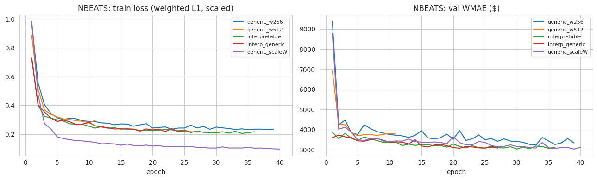
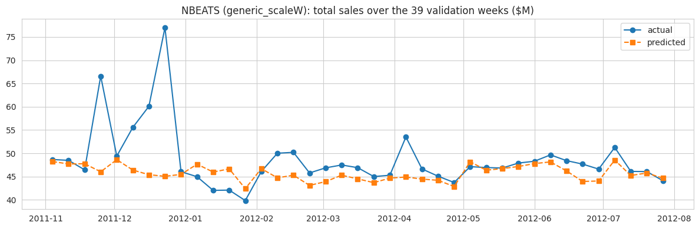

N-BEATS საბოლოოდ ყველაზე ცუდი შედეგია მთელ პროექტში (3,029.2) — მასზე
უარესი მხოლოდ TimesFM-ის ზოგიერთი zero-shot ვარიანტია. ეს არ არის
გასაკვირი: N-BEATS წმინდა უნივარიატულია (მხოლოდ საკუთარი წარსული
გაყიდვები ხედავს, არც markdown, არც CPI, არც სტატიკური მაღაზიის
ატრიბუტები), ხოლო ჩვენი ხის მოდელები ამ ინფორმაციას პირდაპირ იყენებენ.

### 10.6 DLinear

**თეორია.** სერია moving-average-ით (kernel k) იშლება ტრენდად და
სეზონურ ნარჩენად, თითო კომპონენტზე ცალკე `Linear(L→H)`, ჯამი =
პროგნოზი - სულ ~4,000 პარამეტრი. ეს მუშაობს რითეილზე, რადგან "კვირა-52-ის
გაყიდვები ≈ წრფივი ფუნქცია შარშანდელი კვირა-52-ის" ზუსტად ის
დამოკიდებულებაა, რასაც პირდაპირი წრფივი პროექცია სწავლობს. NLinear
(last-value ნორმალიზაცია) და vanilla Linear (არც დეკომპოზიცია, არც
ნორმალიზაცია) იმავე ქაღალდის ვარიანტებია, კონტროლისთვის.

**შედეგები.** ექვსი კონფიგი: საბაზო `dlinear_k25` - 1,852.7, უფრო
პატარა decomposition-kernel-ით (`dlinear_k13`) - 1,837.2 (ოდნავ
უკეთესი - ნაკლებად გლუვი ტრენდი კვირეულ დატაზე უფრო შესაფერისია),
გრძელი 65-კვირიანი input-ით (`dlinear_L65`) - 2,282.4 (მკვეთრად
უარესი - მეტი ისტორია აქ ხმაურს მატებს და არა სიგნალს), NLinear -
1,841.7 (თითქმის იგივე, რაც DLinear - ანუ ორივე ნორმალიზაცია
დაახლოებით ერთნაირად მუშაობს ამ დატაზე), vanilla Linear (არც
დეკომპოზიცია, არც ნორმალიზაცია) - 1,837.5, გასაკვირად თითქმის იგივე,
რაც DLinear-ის საბაზო ვარიანტი - ანუ დეკომპოზიციამ თავისთავად აქ დიდი
სარგებელი არ მოიტანა. ყველაზე დიდი ნახტომი დოლარ-წონიანმა ლოსმა მისცა
(`dlinear_scaleW`) - 1,690.2, ანუ 9%-ით უკეთესი საბაზოზე, იმავე
არქიტექტურით. მთავარი დასკვნა: 4,000-პარამეტრიანმა წრფივმა მოდელმა
(1,690.2) N-BEATS-ის ასეულ ათასობით პარამეტრს (3,029.2) მნიშვნელოვნად
აჯობა.

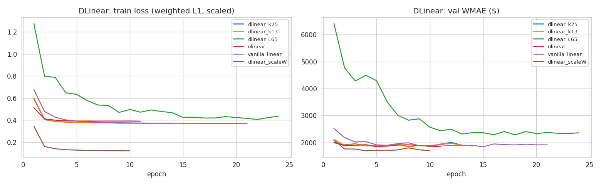
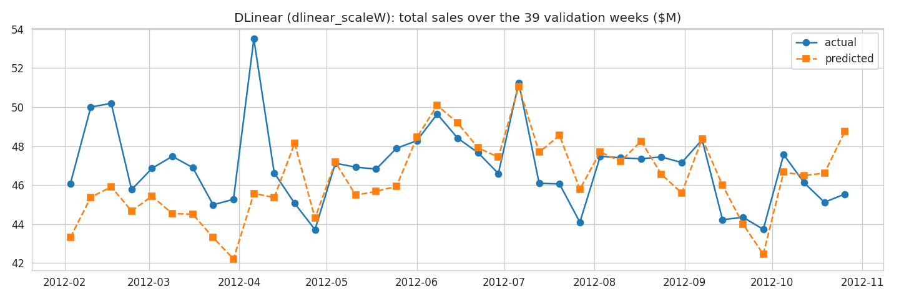

### 10.7 PatchTST

**თეორია.** Patching სერიას პაჩ-სიგრძის გადაფარვად ნაჭრებად ჭრის და
თითო patch ერთი "ტოკენია" - attention წერტილების ნაცვლად ლოკალურ
შაბლონებს ადარებს, sequence length მცირდება (O(N²)-სთვის კრიტიკული).
Channel independence ნიშნავს, რომ ყოველი სერია იმავე ქსელში
დამოუკიდებლად გადის - ჩვენი global per-series ტრენინგი ზუსტად ეს
რეჟიმია. RevIN კი ფანჯარას საკუთარი mean/std-ით ნორმალიზებას უკეთებს
და output-საც უკან ადენორმალიზებს - distribution shift-ის საწინააღმდეგო
მთავარი ხრიკი.

**შედეგები.** ექვსი კონფიგი: კომპაქტურმა საწყისმა (`p8_d64_l2`, 98K
პარამეტრი) 1,689.1 მისცა. Capacity-ის გაზრდამ (`p8_d128_l3`, 460K
პარამეტრი) 1,663.2-მდე გააუმჯობესა - აქ, N-BEATS-ისგან განსხვავებით,
მეტმა capacity-მ ნამდვილად უშველა, სავარაუდოდ transformer-ის attention
მექანიზმი უფრო ეფექტურად იყენებს დამატებით პარამეტრებს, ვიდრე
N-BEATS-ის მარტივი MLP-ბლოკები. წვრილმა პაჩებმა (`p4_d64_l2`, მეტი
ტოკენი, ნაკლები სემანტიკა თითოში) 1,703.5 მისცა - ოდნავ უარესი
საწყისზეც კი. ყველაზე ინფორმატიულმა აბლაციამ - RevIN-ის გამორთვამ
(`p8_d128_norevin`) - 1,654.1 მოგვცა, ანუ ოდნავ უკეთესი, ვიდრე
RevIN-იანი ვერსია (1,663.2) იმავე capacity-ით. ეს გასაკვირია - RevIN
ჩვეულებრივ შველის distribution shift-ის მქონე დატაზე - მაგრამ ჩვენს
შემთხვევაში per-series scaling უკვე ტარდება preprocessing-ის დონეზე,
ანუ RevIN-ის დამატებითი ნორმალიზაცია ნაწილობრივ ზედმეტს
აკეთებს უკვე ნორმალიზებულ დატაზე. კვარტალურმა პაჩმა (`p13_L65_d128`,
გრძელი 65-კვირიანი კონტექსტი) მკვეთრად გააუარესა - 2,010.8, იგივე
"მეტი ისტორია = მეტი ხმაური" ეფექტი, რაც DLinear-შიც დავინახეთ.
საბოლოოდ საუკეთესო კვლავ დოლარ-წონიანი ლოსია (`p8_d128_scaleW`) -
1,624.0.

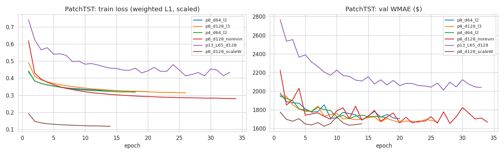
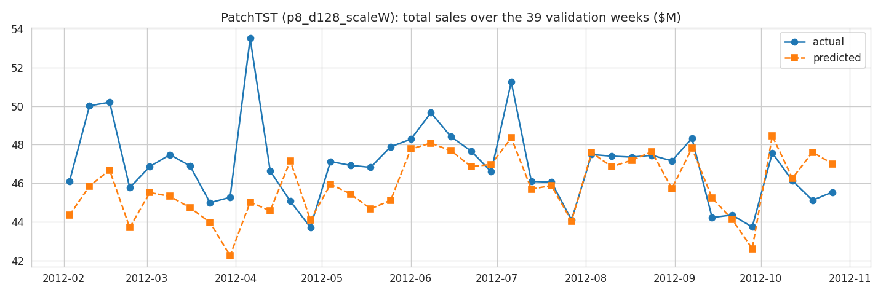


**WandB sweep.** სამივე DL ნოუთბუქში ჩაშენებულია Bayesian
sweep (`RUN_SWEEP=True`, ~8 რანი) — N-BEATS width/blocks/depth/lr-ზე,
DLinear kernel/L/lr-ზე, PatchTST d_model/layers/dropout/patch_len/lr-ზე.
სამივეგან sweep-ის საუკეთესო რანმა ვერ აჯობა ხელით შერჩეულ,
ჰიპოთეზაზე აგებულ საუკეთესო კონფიგს (მაგალითად, DLinear-ის sweep-ის
საუკეთესო შედეგი ~2,267-ს ჩერდება, `dlinear_scaleW`-ის 1,690.2-თან
შედარებით) — რაც კიდევ ერთხელ ადასტურებს, რომ ბრმა
ბაიესური ძებნა ვერ პოულობს იმას, რასაც ჰიპოთეზაზე აგებული, გააზრებული
აბლაცია პოულობს (ამ შემთხვევაში - scale-weighted loss-ის იდეას, რომელიც
sweep-ის საძიებო სივრცეშივე არ იყო შეტანილი).

### 10.8 TimesFM

**შედეგები.** მოკლე კონტექსტმა (`zero_shot_ctx52`, მხოლოდ ბოლო 52
კვირა) 2,833.8 მისცა, სრულმა კონტექსტმა (`zero_shot_full`, მთელი 143
კვირა) — 2,658.8, ანუ მეტმა ისტორიამ (DLinear/PatchTST-ისგან
განსხვავებით, სადაც გრძელი ისტორია აზიანებდა) აქ დაეხმარა pretrained
მოდელს პატერნის ამოცნობაში. Holiday-ინდიკატორის xreg-ად დამატებამ
(`xreg_holiday`) კიდევ უფრო გააუმჯობესა - 2,581.9. საინტერესოა, რომ
დღესასწაულის ტიპის დაზუსტებამ (`xreg_holiday_type` - უბრალო
ბინარულის ნაცვლად, რომელი კონკრეტული დღესასწაულია) პრაქტიკულად
არაფერი შეცვალა (2,581.9, მეათედის სიზუსტემდე იდენტური) - მოდელს
უკვე საკმარისი აქვს მარტივი "ეს holiday-კვირაა" სიგნალი, დამატებითი
დეტალიზაცია ღირებულებას აღარ მატებს. ეს პირდაპირი დადასტურებაა იმისა,
რასაც მთელ პროექტში ვამბობთ, რომ ეგზოგენური სიგნალის ხელმისაწვდომობა
(თუნდაც უმარტივესი ბინარული ფლაგის სახით) ერთადერთი უნივარიატული DL
მოდელისთვისაც კი (TimesFM-ისთვის, რომელსაც ტრენინგიც კი არ სჭირდება)
რეალურ სარგებელს იძლევა.

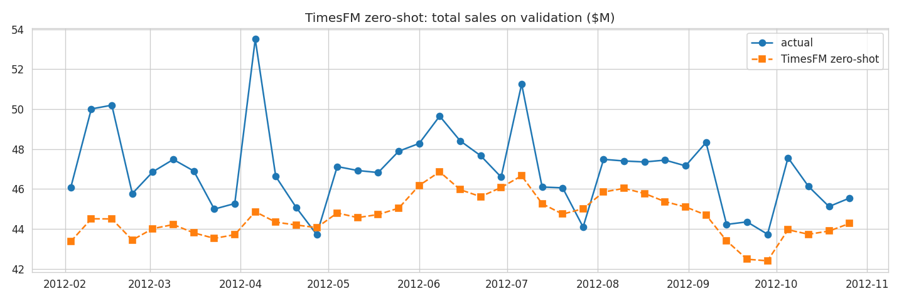

TimesFM (საუკეთესო — 2,581.9) baseline-ზე (1,704.0) უარესია, მაგრამ
NBEATS-ს (3,029.2) სჯობს - ანუ pretrained, არავითარი ტრენინგის
გარეშე მოდელმა ჩვენს დატაზე ტრენინგგავლილ DL არქიტექტურას (N-BEATS)
აჯობა. ეს ცხადყოფს, თუ რამდენად ღირებულია ამოცანაზე მოდელის მორგება
(ხის მოდელები, რომლებიც ჩვენს კონკრეტულ დატაზეა
დატრენინგებული, კვლავ ძალიან წინაა), მაგრამ ასევე გვიჩვენებს
foundation-მოდელების პრაქტიკულ პოტენციალს იქ, სადაც საკუთარი
ტრენინგისთვის დრო ან ინფრასტრუქტურა არ არსებობს.

---

## 11. Post-processing: საშობაო კვირის შიფტი

გამარჯვებული Kaggle solution-ის დაკვირვება: შობამდე დღეები
კვირის რომელ დღეს ხვდება, წლიდან წლამდე ინაცვლებს. ტესტის 2012 წელს,
52-ე კვირაში (კვირა, რომელიც 2012-12-28-ს მთავრდება) დაახლოებით 2.5
დღით მეტი შობისწინა სავაჭრო დღე ხვდება, ვიდრე ტრეინის 2010/2011 წლებში,
საიდანაც lag-ფიჩერები და სეზონური პროფილები სწავლობენ. ჩვენი მოდელები
ამას ნაწილობრივ ხედავენ `Pre_Christmas_Days`-ის ფიჩერით, მაგრამ
დაზღვევისთვის post-processing ვარიანტსაც ვამზადებთ: 49-52 კვირების
პროგნოზში წინა კვირის პროგნოზის 2.5/7 წილს წინ გადმოგვაქვს.

ეს ლოკალურად ვერ მოწმდება — ჩვენს ვალიდაციაში (რომელიც არც ერთი
მოდელისთვის არ ფარავს რეალურ 2012 წლის შობას) ეს ეფექტი უბრალოდ არ
ჩანს. ამიტომ ორივე ვარიანტი (შიფტით და შიფტის გარეშე) ცალკე ავტვირთეთ
Kaggle-ზე. შედეგი ცალსახად აჩვენებს, რომ შიფტმა იმუშავა, და საკმაოდ
დიდი განსხვავებით - XGBoost-ის (ჩვენი გამარჯვებული მოდელი) რეგისტრირებული
პაიპლაინიდან გამოტანილი submission.csv-ს public score 3,195.0-ია
(private - 3,324.8), ხოლო იმავე პროგნოზზე გადადებული საშობაო შიფტით
(submission_xmas_shift.csv) public score 2,862.1-მდე დაეცა (private —
2,949.9-მდე) - ანუ ~333-375 ქულიანი გაუმჯობესება. ეს
ერთადერთი ადგილია მთელ პროექტში, სადაც კალენდრის ერთი მარტივი,
დეტერმინისტული კორექცია რამდენიმე ასეული ქულით გაუმჯობესებას
იძლევა - და ეს ზუსტად იმიტომ ხდება, რომ ეს კორექცია ეხება ზუსტად იმ
კვირებს, რომლებსაც მეტრიკა ყველაზე მეტად სჯის (5x წონა) და რომლებზეც
ჩვენს არც ერთ მოდელს ვალიდაციაში ნანახი არ ჰქონდა.

---

## 12. საბოლოო შედარება და გამარჯვებული

| არქიტექტურა | ოჯახი | val WMAE | CV WMAE (mean ± std) |
|---|---|---|---|
| Seasonal naive | baseline | 1,704.0 | — |
| LightGBM | trees | 1,526.2 | 1,996.4 ± 561.9 |
| *XGBoost* | *trees* | *1,533.3* | *1,933.4 ± 441.3* |
| SARIMA (store-level, m=52) | classical | 1,538.9 | — |
| PatchTST | deep learning | 1,624.0 | — |
| DLinear | deep learning | 1,690.2 | — |
| Prophet (store-level, multiplicative) | classical | 2,065.6 | — |
| TimesFM (xreg_holiday, zero-shot) | foundation | 2,581.9 | — |
| N-BEATS | deep learning | 3,029.2 | — |

გამარჯვებული არქიტექტურა — *XGBoost*, დარეგისტრირებული Model Registry-ში
`WalmartBestModel v2`-ად. ორი ფინალისტი ერთჯერად hold-out-ზე პრაქტიკულად
თანაბარია (XGBoost 1,533.3 vs LightGBM 1,526.2 - ~0.5% სხვაობა, რაც ერთ
13-კვირიან ფანჯარაზე შემთხვევითობის ფარგლებშია), მაგრამ ყველა უფრო მდგრადი
კრიტერიუმი XGBoost-ის მხარესაა: 3-fold expanding CV-ზე უკეთესი საშუალო და
დაბალი std (1,933.4 +- 441.3 vs 1,996.4 +- 561.9), უკეთესი worst-case fold
(2,548.3 vs 2,786.3), უკეთესი ქულა ორივე ვარიანტში. თავდაპირველად, ლოკალური
hold-out-ის ვიწრო მარჟით, `WalmartBestModel v1`-ად LightGBM დარეგისტრირდა,
მაგრამ ეს მარჟა ტესტზე არ გადაითარგმნა - CV-ის პროგნოზი კი ზუსტად
დადასტურდა, ამიტომ საბოლოო გამარჯვებულად XGBoost დარეგისტრირდა v2-ად
(model_inference.ipynb ტვირთავს `latest`-ს). ეს თავად არის პროექტის
ერთ-ერთი მთავარი მეთოდოლოგიური გაკვეთილი: ერთი ვიწრო ვალიდაციის ფანჯარა
საბოლოო არჩევანისთვის საკმარისი არ არის, მრავალ-fold შეფასება და
out-of-sample არბიტრი კი - აუცილებელი.

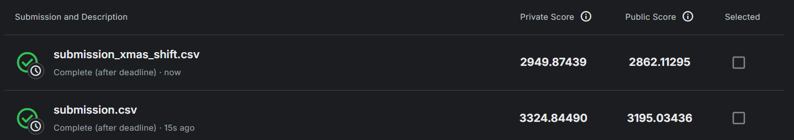

Kaggle-ზე XGBoost-ის რეგისტრირებული მოდელით `model_inference.ipynb`-იდან
გამოტანილმა `submission.csv`-მ 3,195.0 public / 3,324.8 private score მოგვცა,
საშობაო შიფტიანმა ვერსიამ კი - 2,862.1 public / 2,949.9 private.
შედარებისთვის LightGBM-ის იგივე წყვილი: 3,238.6 / 3,417.9 შიფტის გარეშე და
2,897.8 / 3,031.4 შიფტით - ანუ XGBoost ოთხივე ჭრილში წინაა.

ერთი პატიოსანი და საინტერესო დაკვირვება: ლოკალური val WMAE (1,533.3) და
Kaggle-ის public score (3,195.0, შიფტამდე) ორჯერზე მეტად განსხვავდება.
ეს არ არის ცუდი ნიშანი ან შეცდომა — ის პირდაპირ ადასტურებს იმას, რომ
ჩვენი 13-კვირიანი ვალიდაცია (2012 აგვისტო-ოქტომბერი) არასდროს შეიცავს
რეალურ Thanksgiving/Christmas კვირებს, ტესტი კი ზუსტად ამ ორ ყველაზე
რთულ და მაღალწონიან კვირას შეიცავს. ანუ ლოკალური რიცხვი გვეუბნება
"რამდენად კარგად ვსწავლობთ ჩვეულებრივ კვირებს", Kaggle score კი -
"რამდენად კარგად ვწინასწარმეტყველებთ წლის ყველაზე ექსტრემალურ მოვლენებს",
და ეს ორი პრინციპულად სხვადასხვა კითხვაა. სწორედ ამიტომ იძლევა საშობაო
შიფტი ასეთ დიდ გაუმჯობესებას - ის ზუსტად იმ ნაწილს ეხმარება, რომელსაც
ვალიდაცია საერთოდ ვერ ზომავდა.

---

## 13. MLflow ტრექინგი და სტრუქტურა

**ლინკი:** https://dagshub.com/rkvit23/ML-FINAL.mlflow

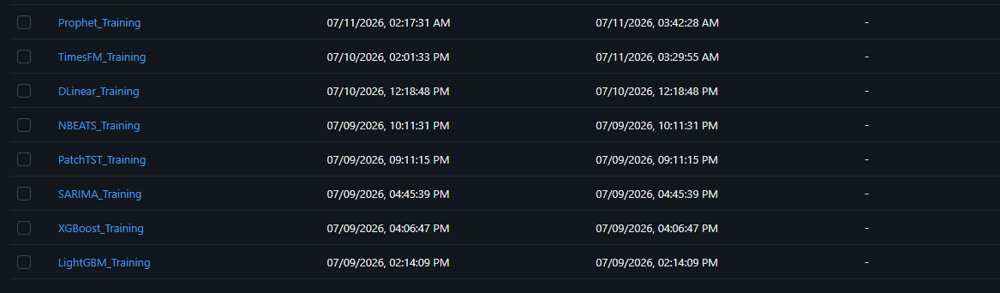
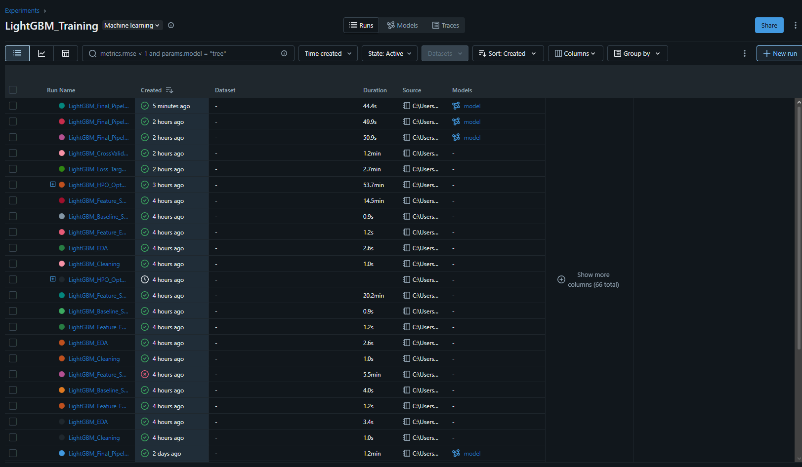

ეს ორი სქრინშოტი აჩვენებს რვავე ექსპერიმენტს (თითო არქიტექტურაზე ცალკე)
და LightGBM_Training-ის სრულ, ეტაპობრივ რანების ისტორიას — Cleaning-იდან
Final_Pipeline-მდე, HPO-ს 30 nested trial-ის ჩათვლით.

**Pipeline-ების დიზაინი.** ყველა არქიტექტურის საუკეთესო მოდელი ილოგება
Pipeline-ად, რომელიც პირდაპირ დაუმუშავებელ test.csv-ზე ეშვება. ხის
მოდელებში ეს `sklearn.Pipeline(WalmartFeatureBuilder → Regressor)`-ია -
builder-ში ჩაშენებულია ისტორია და side-ცხრილებიც, ანუ transform-ს გარე
ფაილი არ სჭირდება. DL-ში `mlflow.pyfunc` wrapper-ია (`TorchForecastPipeline`
`models.py`-დან) - მოდელის წონები, ისტორიის ბოლო L კვირა, სკალები და
fallback ცხრილი ერთადაა შენახული. კლასიკურ მოდელებში კი
`StoreShareForecastPipeline` (ასევე `models.py`-დან) - store-დონის
39-კვირიანი პროგნოზები და წილების ცხრილები, ისე, რომ ჩამოტვირთვისას
statsmodels/prophet აღარც სჭირდება ხელახლა გამოძახება. ტესტში უცნობი
(Store, Dept) 11 წყვილისთვის ყველა პაიპლაინში fallback-ჯაჭვია. ყველა
`log_model`-ს გადაეცემა `code_paths` - `preprocessing.py`, `evaluation.py`
და (DL/კლასიკურ მოდელებში) `models.py` — ანუ პაიპლაინის კლასები საერთო
მოდულებში ცხოვრობს და pickle მათ მითითებით ინახავს, code_paths კი ამ
მოდულებს მოდელის არტიფაქტშივე დებს, ამიტომ `mlflow.pyfunc.load_model`
ნებისმიერ გარემოში მუშაობს ამ ფაილების ხელით მიწოდების გარეშე.

**Model Registry + Inference.** XGBoost დარეგისტრირდა `WalmartBestModelv2`-ის
სახელით (v1 - LightGBM, ლოკალური hold-out-ის თავდაპირველი არჩევანი). inference ტვირთავს latest-ს".
`model_inference.ipynb` მას `models:/WalmartBestModel/latest`-იდან
ტვირთავს, ვარაუდობს raw test-ს და აწყობს `submission.csv`-ს (და
საშობაო შიფტიან ვერსიასაც). pyfunc უნივერსალურია - sklearn პაიპლაინიც და
ჩვენი wrapper-ებიც ერთი ინტერფეისით იტვირთება, ანუ inference-კოდი არ
იცვლება იმის მიხედვით, რომელი ოჯახი მოიგებს.

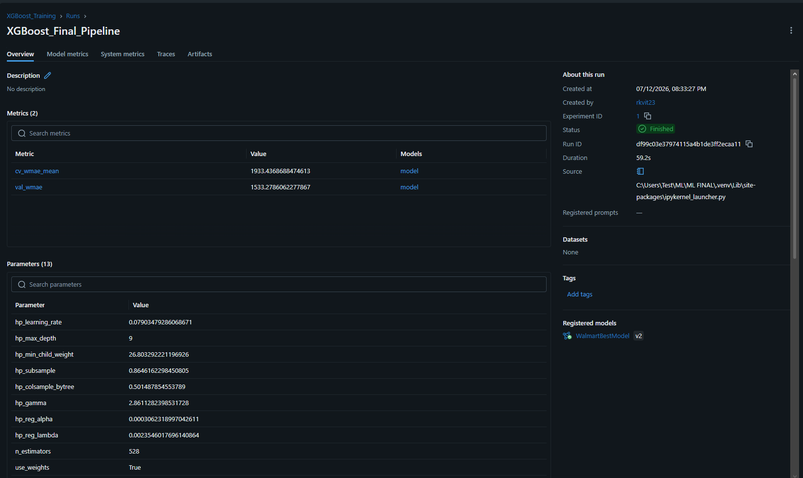
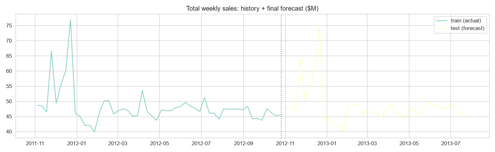

---

## 14. WandB (ნეირონული ქსელები)

**პროექტი:** https://wandb.ai/rkvit23-free-university-of-tbilisi-/walmart-final

DL ნოუთბუქები (N-BEATS, DLinear, PatchTST) ორივეგან ლოგავენ - MLflow-ში,
ერთიანი შედარებისთვის ყველა არქიტექტურასთან, და WandB-ში, learning
curve-ების ინტერაქტიული შედარებისთვის, კონფიგების პარალელური
კოორდინატებისა და sweep-ებისთვის. სტრუქტურა: group = `{ARCH}_Training`,
run = კონფიგის სახელი, per-epoch - `train_loss`, `val_wmae`, summary -
`best_val_wmae`, `best_epoch`, `n_parameters`. სამივე ნოუთბუქში
ჩართულია Bayesian sweep (`RUN_SWEEP=True`, ~8 რანი თითოზე).

---

## 15. გუნდური მუშაობა

ერთობლივი ეტაპი იყო ამოცანის სპეციფიკის გარჩევა — WMAE-ს ანალიზი,
39-კვირიანი ჰორიზონტის შეზღუდვები, leakage-რისკები — ასევე EDA,
cleaning/FE წესები და ვალიდაციის სქემა, რომ ყველა მოდელი ერთსა და
იმავე საფუძველზე ყოფილიყო შედარებული (`preprocessing.py`,
`evaluation.py`). ამის შემდეგ არქიტექტურები გავინაწილეთ: რომა - 
(LightGBM, XGBoost, SARIMA, DLinear, PatchTST) - ხის მოდელები,
კლასიკური SARIMA და  ორივე ეფექტური DL არქიტექტურაც.
გუნდის მეორე წევრი, ანდრია - N-BEATS, Prophet და TimesFM. საერთო DL-ინფრასტრუქტურა 
(`models.py`-ის საზიარო კლასები:`NBeats`, `DLinear`, `PatchTST`, `TorchForecastPipeline`,
`StoreShareForecastPipeline`) გუნდურად ჩამოყალიბდა, რომ დუბლირებული
კოდი აღარ ყოფილიყო სამივე DL ნოუთბუქში ცალ-ცალკე. შედეგებს
ერთმანეთს MLflow/DagsHub-ის საერთო workspace-ით ვუზიარებდით (ორივე
`rkvit23`-ის აქაუნთზე, ერთსა და იმავე რეპოზე), საბოლოო შედარება,
გამარჯვებულის შერჩევა და README კი ერთად, ამ დოკუმენტში.